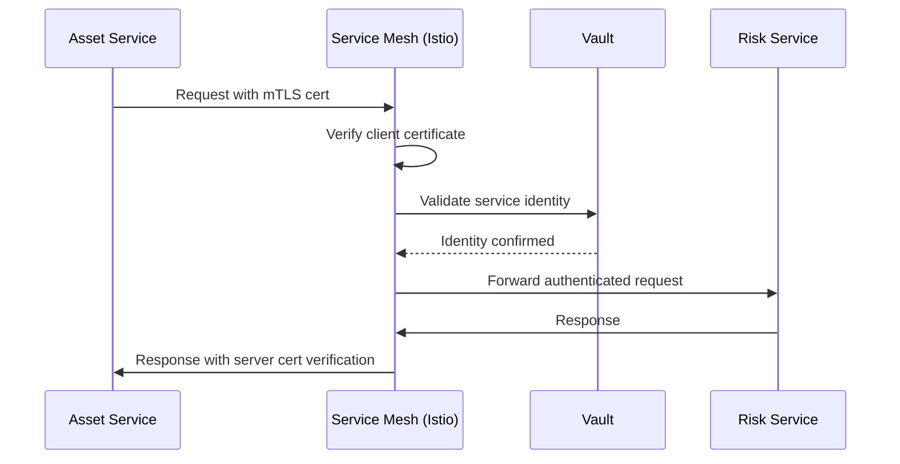

# Security Architecture Recommendations

## Executive Summary

The transition from a serverless Lambda-based monolithic architecture to containerized microservices significantly expands the attack surface while introducing new security challenges. This design implements a comprehensive zero-trust security model with mutual TLS (mTLS), robust authentication/authorization patterns, and defense-in-depth strategies to secure service-to-service communication across 8-10 microservices handling 1000+ RPS per service.

## Threat Model Analysis

### Identified Threat Actors and Motivations

| Threat Actor | Motivation | Likelihood | Capability Level |
|-------------|------------|------------|------------------|
| External Attackers | Data exfiltration, ransomware, service disruption | High | Advanced |
| Insider Threats | Data theft, privilege escalation, sabotage | Medium | High |
| Nation-State APTs | Espionage, infrastructure compromise | Medium | Advanced |
| Automated Bots | Credential stuffing, DDoS, vulnerability exploitation | High | Medium |

### Attack Vectors and Entry Points

**Expanded Attack Surface from Microservices:**
- **Network Communication**: Inter-service API calls (8-10 services × mesh connectivity)
- **Container Runtime**: Kubernetes pods and container escape vulnerabilities
- **Service Registry**: Consul/Eureka compromise leading to service impersonation
- **API Gateway**: Single point of failure with elevated privileges
- **Secret Management**: Distributed secrets across multiple services and containers
- **Container Images**: Supply chain attacks through base images and dependencies
- **Service Mesh Data Plane**: Envoy proxy vulnerabilities and misconfigurations

**Legacy Attack Vectors (Retained):**
- **DynamoDB Access**: Per-service data isolation bypasses
- **Neo4j Graph Database**: Cypher injection and privilege escalation
- **Authentication Services**: Cognito JWT token manipulation
- **External APIs**: Third-party integration vulnerabilities

### Asset Inventory and Sensitivity Classification

| Asset Category | Sensitivity Level | Services Affected | Protection Requirements |
|----------------|------------------|-------------------|------------------------|
| Customer PII | Critical | User Service, Account Service | Encryption at rest/transit, RBAC, audit logging |
| Security Scan Results | High | Scanner Service, Risk Service | mTLS, service isolation, data classification |
| Attack Surface Data | High | Asset Service, Discovery Service | Graph database encryption, access controls |
| Authentication Tokens | Critical | All Services | Short-lived tokens, secure storage, rotation |
| Service Secrets | High | All Services | Vault integration, rotation, least privilege |
| Container Images | Medium | All Services | Signed images, vulnerability scanning |

### Trust Boundaries and Data Flows

```
Internet → API Gateway → Service Mesh → Microservices → Data Layer
    ↓           ↓              ↓              ↓              ↓
Untrusted   DMZ Zone    Internal Network  Service Pods   Encrypted Storage
```

**Trust Boundaries:**
1. **Perimeter (Internet → API Gateway)**: WAF, DDoS protection, rate limiting
2. **Service Mesh Entry**: Authentication, authorization, traffic encryption
3. **Inter-Service Communication**: mTLS, service identity verification
4. **Pod-to-Pod**: Network policies, container isolation
5. **Data Access**: Encryption, access logging, data classification

## Security Controls Architecture

### Zero-Trust Implementation Strategy

#### Core Principles
1. **Never Trust, Always Verify**: Every request authenticated and authorized
2. **Least Privilege Access**: Minimal permissions for each service identity
3. **Assume Breach**: Continuous monitoring and incident response readiness
4. **Verify Explicitly**: Multi-factor authentication and context-aware policies

#### Implementation Layers

**Layer 1: Identity and Access Management**
```yaml
# Service Identity Configuration
apiVersion: security.istio.io/v1beta1
kind: PeerAuthentication
metadata:
  name: default
  namespace: chariot-services
spec:
  mtls:
    mode: STRICT

---
apiVersion: security.istio.io/v1beta1
kind: AuthorizationPolicy
metadata:
  name: service-to-service
spec:
  rules:
  - from:
    - source:
        principals: ["cluster.local/ns/chariot-services/sa/asset-service"]
    to:
    - operation:
        methods: ["GET", "POST"]
        paths: ["/api/v1/risks/*"]
```

**Layer 2: Network Segmentation**
```yaml
# Network Policy for Service Isolation
apiVersion: networking.k8s.io/v1
kind: NetworkPolicy
metadata:
  name: asset-service-netpol
spec:
  podSelector:
    matchLabels:
      app: asset-service
  ingress:
  - from:
    - namespaceSelector:
        matchLabels:
          name: chariot-services
    - podSelector:
        matchLabels:
          app: api-gateway
    ports:
    - protocol: TCP
      port: 8080
  egress:
  - to:
    - podSelector:
        matchLabels:
          app: risk-service
    ports:
    - protocol: TCP
      port: 8080
```

### Authentication and Authorization Patterns

#### Service-to-Service Authentication Flow



#### JWT Token Management for External Requests

```go
// JWT Validation Middleware
type JWTValidator struct {
    cognitoClient *cognito.Client
    publicKeys    map[string]*rsa.PublicKey
    cache         *cache.TTLCache
}

func (j *JWTValidator) ValidateToken(token string) (*UserClaims, error) {
    // 1. Parse JWT without verification to get kid
    unverified, err := jwt.Parse(token, nil)
    if err != nil {
        return nil, fmt.Errorf("invalid token format: %w", err)
    }
    
    // 2. Get public key for verification
    kid := unverified.Header["kid"].(string)
    publicKey := j.getPublicKey(kid)
    
    // 3. Verify token signature and claims
    claims := &UserClaims{}
    parsedToken, err := jwt.ParseWithClaims(token, claims, func(token *jwt.Token) (interface{}, error) {
        return publicKey, nil
    })
    
    if err != nil || !parsedToken.Valid {
        return nil, fmt.Errorf("invalid token: %w", err)
    }
    
    // 4. Additional security validations
    if err := j.validateClaims(claims); err != nil {
        return nil, err
    }
    
    return claims, nil
}

func (j *JWTValidator) validateClaims(claims *UserClaims) error {
    // Check token expiration with buffer
    if time.Now().Add(30*time.Second).After(claims.ExpiresAt.Time) {
        return errors.New("token expired or expiring soon")
    }
    
    // Validate audience
    if !claims.VerifyAudience("chariot-api", true) {
        return errors.New("invalid audience")
    }
    
    // Check issuer
    if claims.Issuer != "https://cognito-idp.us-east-1.amazonaws.com/us-east-1_XXXXXXXX" {
        return errors.New("invalid issuer")
    }
    
    return nil
}
```

#### Role-Based Access Control (RBAC) Implementation

```go
// RBAC Authorization Engine
type RBACEngine struct {
    policyStore PolicyStore
    cache       *cache.TTLCache
}

type Permission struct {
    Resource string
    Action   string
    Effect   string // ALLOW or DENY
}

type Role struct {
    Name        string
    Permissions []Permission
}

func (r *RBACEngine) Authorize(userID, resource, action string) error {
    // 1. Get user roles
    roles, err := r.getUserRoles(userID)
    if err != nil {
        return fmt.Errorf("failed to get user roles: %w", err)
    }
    
    // 2. Check permissions
    for _, role := range roles {
        for _, perm := range role.Permissions {
            if r.matchesPermission(perm, resource, action) {
                if perm.Effect == "DENY" {
                    return fmt.Errorf("access denied by explicit deny rule")
                }
                if perm.Effect == "ALLOW" {
                    return nil
                }
            }
        }
    }
    
    // 3. Default deny
    return fmt.Errorf("no matching allow rule found")
}

// Service-specific RBAC policies
var servicePolicies = map[string][]Role{
    "asset-service": {
        {
            Name: "asset-reader",
            Permissions: []Permission{
                {Resource: "/api/v1/assets/*", Action: "GET", Effect: "ALLOW"},
            },
        },
        {
            Name: "asset-admin",
            Permissions: []Permission{
                {Resource: "/api/v1/assets/*", Action: "*", Effect: "ALLOW"},
                {Resource: "/api/v1/admin/*", Action: "*", Effect: "ALLOW"},
            },
        },
    },
}
```

### Mutual TLS (mTLS) Certificate Management

#### Certificate Authority Architecture

```yaml
# Root CA Configuration
apiVersion: v1
kind: Secret
metadata:
  name: istio-ca-secret
  namespace: istio-system
type: Opaque
data:
  root-cert.pem: # Root CA certificate
  cert-chain.pem: # Certificate chain
  root-key.pem: # Root CA private key

---
# Intermediate CA for Service Mesh
apiVersion: install.istio.io/v1alpha1
kind: IstioOperator
metadata:
  name: control-plane
spec:
  values:
    pilot:
      env:
        EXTERNAL_CA: ISTIOD_RA_KUBERNETES_API
        CERT_SIGNER_DOMAIN: chariot.local
```

#### Automated Certificate Lifecycle Management

```go
// Certificate Rotation Service
type CertificateManager struct {
    vaultClient   *vault.Client
    k8sClient     kubernetes.Interface
    rotationCh    chan CertRotationEvent
    certStore     map[string]*CertificateInfo
    mutex         sync.RWMutex
}

type CertificateInfo struct {
    ServiceName   string
    Certificate   *x509.Certificate
    PrivateKey    crypto.PrivateKey
    ExpiresAt     time.Time
    LastRotated   time.Time
    RotationCount int
}

func (cm *CertificateManager) StartCertificateRotation(ctx context.Context) {
    ticker := time.NewTicker(1 * time.Hour) // Check every hour
    defer ticker.Stop()
    
    for {
        select {
        case <-ctx.Done():
            return
        case <-ticker.C:
            cm.checkAndRotateCertificates(ctx)
        case event := <-cm.rotationCh:
            cm.handleRotationEvent(ctx, event)
        }
    }
}

func (cm *CertificateManager) checkAndRotateCertificates(ctx context.Context) {
    cm.mutex.RLock()
    defer cm.mutex.RUnlock()
    
    for serviceName, certInfo := range cm.certStore {
        // Rotate certificates 24 hours before expiry
        if time.Until(certInfo.ExpiresAt) < 24*time.Hour {
            go cm.rotateCertificate(ctx, serviceName)
        }
    }
}

func (cm *CertificateManager) rotateCertificate(ctx context.Context, serviceName string) error {
    // 1. Generate new certificate from Vault
    newCert, newKey, err := cm.generateNewCertificate(serviceName)
    if err != nil {
        return fmt.Errorf("failed to generate certificate for %s: %w", serviceName, err)
    }
    
    // 2. Update Kubernetes secret
    secretName := fmt.Sprintf("%s-tls-cert", serviceName)
    err = cm.updateK8sSecret(ctx, secretName, newCert, newKey)
    if err != nil {
        return fmt.Errorf("failed to update k8s secret: %w", err)
    }
    
    // 3. Trigger service restart for certificate reload
    err = cm.triggerServiceRestart(ctx, serviceName)
    if err != nil {
        return fmt.Errorf("failed to restart service: %w", err)
    }
    
    // 4. Update internal certificate store
    cm.updateCertificateStore(serviceName, newCert, newKey)
    
    log.Info("Certificate rotated successfully", "service", serviceName)
    return nil
}
```

#### Service Identity and SPIFFE Integration

```go
// SPIFFE Identity Management
type SPIFFEIdentityManager struct {
    spireClient spire.Client
    identityMap map[string]*SPIFFEIdentity
}

type SPIFFEIdentity struct {
    SPIFFEID    string
    ServiceName string
    Certificate *x509.Certificate
    Bundle      *x509.CertPool
    ValidUntil  time.Time
}

func (sim *SPIFFEIdentityManager) GetServiceIdentity(serviceName string) (*SPIFFEIdentity, error) {
    spiffeID := fmt.Sprintf("spiffe://chariot.local/ns/chariot-services/sa/%s", serviceName)
    
    // Get SVID (SPIFFE Verifiable Identity Document)
    svid, err := sim.spireClient.FetchX509SVID(context.Background(), spiffeID)
    if err != nil {
        return nil, fmt.Errorf("failed to fetch SVID: %w", err)
    }
    
    return &SPIFFEIdentity{
        SPIFFEID:    spiffeID,
        ServiceName: serviceName,
        Certificate: svid.Certificates[0],
        Bundle:      svid.Bundle,
        ValidUntil:  svid.Certificates[0].NotAfter,
    }, nil
}
```

### Secret Management and Rotation

#### HashiCorp Vault Integration

```yaml
# Vault Configuration for Kubernetes
apiVersion: v1
kind: ConfigMap
metadata:
  name: vault-config
data:
  vault.hcl: |
    storage "consul" {
      address = "consul:8500"
      path = "vault/"
    }
    
    listener "tcp" {
      address = "0.0.0.0:8200"
      tls_disable = 0
      tls_cert_file = "/vault/certs/vault.crt"
      tls_key_file = "/vault/certs/vault.key"
    }
    
    seal "awskms" {
      region = "us-east-1"
      kms_key_id = "vault-unseal-key"
    }
    
    api_addr = "https://vault.chariot.local:8200"
    cluster_addr = "https://vault.chariot.local:8201"

---
# Vault Agent Sidecar Configuration
apiVersion: v1
kind: ConfigMap
metadata:
  name: vault-agent-config
data:
  config.hcl: |
    pid_file = "/home/vault/pidfile"
    
    auto_auth {
      method "kubernetes" {
        mount_path = "auth/kubernetes"
        config = {
          role = "asset-service"
        }
      }
      
      sink "file" {
        config = {
          path = "/home/vault/.vault-token"
        }
      }
    }
    
    template {
      source = "/vault/secrets/db-creds.tpl"
      destination = "/vault/secrets/db-creds.json"
      command = "supervisorctl restart app"
    }
```

#### Dynamic Secret Rotation

```go
// Secret Rotation Manager
type SecretRotationManager struct {
    vaultClient  *vault.Client
    secretStore  map[string]*SecretInfo
    rotationJobs map[string]*RotationJob
    mutex        sync.RWMutex
}

type SecretInfo struct {
    Path         string
    Type         string // database, api-key, certificate
    LastRotated  time.Time
    RotationTTL  time.Duration
    Services     []string // Services using this secret
}

type RotationJob struct {
    SecretPath   string
    ScheduledFor time.Time
    Status       string
    RetryCount   int
}

func (srm *SecretRotationManager) RotateDatabaseCredentials(serviceName string) error {
    // 1. Create new database credentials
    newCreds, err := srm.createDatabaseCredentials(serviceName)
    if err != nil {
        return fmt.Errorf("failed to create new credentials: %w", err)
    }
    
    // 2. Store in Vault with lease
    secretPath := fmt.Sprintf("database/creds/%s", serviceName)
    lease, err := srm.vaultClient.Logical().Write(secretPath, map[string]interface{}{
        "username": newCreds.Username,
        "password": newCreds.Password,
        "ttl":      "24h",
    })
    if err != nil {
        return fmt.Errorf("failed to store credentials in Vault: %w", err)
    }
    
    // 3. Update service configuration
    err = srm.updateServiceConfig(serviceName, secretPath)
    if err != nil {
        // Rollback: revoke the new lease
        srm.vaultClient.Logical().Write("sys/leases/revoke", map[string]interface{}{
            "lease_id": lease.LeaseID,
        })
        return fmt.Errorf("failed to update service config: %w", err)
    }
    
    // 4. Verify connectivity with new credentials
    if err := srm.testDatabaseConnection(serviceName, newCreds); err != nil {
        return fmt.Errorf("new credentials failed connectivity test: %w", err)
    }
    
    // 5. Schedule old credentials for revocation (grace period)
    time.AfterFunc(5*time.Minute, func() {
        srm.revokeOldCredentials(serviceName)
    })
    
    return nil
}

func (srm *SecretRotationManager) StartRotationScheduler(ctx context.Context) {
    ticker := time.NewTicker(1 * time.Hour)
    defer ticker.Stop()
    
    for {
        select {
        case <-ctx.Done():
            return
        case <-ticker.C:
            srm.processRotationJobs(ctx)
        }
    }
}
```

### Network Security and Segmentation

#### Service Mesh Security Policies

```yaml
# Istio Service Mesh Security Configuration
apiVersion: security.istio.io/v1beta1
kind: PeerAuthentication
metadata:
  name: chariot-mtls-policy
  namespace: chariot-services
spec:
  mtls:
    mode: STRICT

---
# Granular Authorization Policies
apiVersion: security.istio.io/v1beta1
kind: AuthorizationPolicy
metadata:
  name: asset-service-authz
  namespace: chariot-services
spec:
  selector:
    matchLabels:
      app: asset-service
  rules:
  # Allow API Gateway to call asset service
  - from:
    - source:
        principals: ["cluster.local/ns/chariot-services/sa/api-gateway"]
    to:
    - operation:
        methods: ["GET", "POST", "PUT", "DELETE"]
        paths: ["/api/v1/assets/*"]
  
  # Allow risk service to query assets
  - from:
    - source:
        principals: ["cluster.local/ns/chariot-services/sa/risk-service"]
    to:
    - operation:
        methods: ["GET"]
        paths: ["/api/v1/assets/*/risks"]

---
# Rate Limiting Configuration
apiVersion: networking.istio.io/v1alpha3
kind: EnvoyFilter
metadata:
  name: rate-limit-asset-service
spec:
  workloadSelector:
    labels:
      app: asset-service
  configPatches:
  - applyTo: HTTP_FILTER
    match:
      context: SIDECAR_INBOUND
      listener:
        filterChain:
          filter:
            name: "envoy.filters.network.http_connection_manager"
    patch:
      operation: INSERT_BEFORE
      value:
        name: envoy.filters.http.local_ratelimit
        typed_config:
          "@type": type.googleapis.com/udpa.type.v1.TypedStruct
          type_url: type.googleapis.com/envoy.extensions.filters.http.local_ratelimit.v3.LocalRateLimit
          value:
            stat_prefix: local_rate_limiter
            token_bucket:
              max_tokens: 1000
              tokens_per_fill: 1000
              fill_interval: 1s
```

#### Kubernetes Network Policies

```yaml
# Network Segmentation Policies
apiVersion: networking.k8s.io/v1
kind: NetworkPolicy
metadata:
  name: chariot-services-isolation
  namespace: chariot-services
spec:
  podSelector: {}
  policyTypes:
  - Ingress
  - Egress
  ingress:
  # Allow ingress from istio-system (service mesh)
  - from:
    - namespaceSelector:
        matchLabels:
          name: istio-system
  # Allow inter-service communication within namespace
  - from:
    - namespaceSelector:
        matchLabels:
          name: chariot-services
  egress:
  # Allow egress to istio-system
  - to:
    - namespaceSelector:
        matchLabels:
          name: istio-system
  # Allow DNS resolution
  - to: []
    ports:
    - protocol: UDP
      port: 53
  # Allow communication to data layer
  - to:
    - namespaceSelector:
        matchLabels:
          name: chariot-data
    ports:
    - protocol: TCP
      port: 5432  # PostgreSQL
    - protocol: TCP
      port: 7687  # Neo4j

---
# Data Layer Network Policy
apiVersion: networking.k8s.io/v1
kind: NetworkPolicy
metadata:
  name: chariot-data-isolation
  namespace: chariot-data
spec:
  podSelector: {}
  policyTypes:
  - Ingress
  ingress:
  # Only allow access from chariot-services namespace
  - from:
    - namespaceSelector:
        matchLabels:
          name: chariot-services
    ports:
    - protocol: TCP
      port: 5432
    - protocol: TCP
      port: 7687
```

## Risk Assessment

| Risk | Likelihood | Impact | Mitigation Strategy | Priority |
|------|------------|--------|-------------------|----------|
| Service Mesh Compromise | Medium | Critical | mTLS enforcement, regular certificate rotation, SPIFFE identity | P0 |
| Container Escape | Low | High | Runtime security (Falco), minimal base images, non-root containers | P1 |
| Secrets Exposure | Medium | High | Vault integration, automatic rotation, encrypted transit/rest | P0 |
| Inter-Service Communication Interception | Low | Critical | mTLS mandatory, network policies, encrypted data plane | P0 |
| API Gateway Single Point of Failure | High | High | Multi-instance deployment, circuit breakers, health checks | P0 |
| Certificate Authority Compromise | Low | Critical | Hardware security module, offline root CA, intermediate CA rotation | P1 |
| Service Identity Spoofing | Medium | High | SPIFFE/SPIRE implementation, workload attestation | P0 |
| Database Connection Pool Exhaustion | Medium | Medium | Connection limits, circuit breakers, health checks | P2 |
| Distributed Denial of Service | High | Medium | Rate limiting, auto-scaling, traffic shaping | P1 |
| Configuration Drift | Medium | Medium | GitOps, policy as code, configuration monitoring | P2 |

## Security Testing Strategy

### Security Test Scenarios

**Authentication Testing:**
- JWT token expiration and refresh handling
- Invalid token rejection
- Service identity verification
- Certificate validation edge cases
- Multi-tenant isolation verification

**Authorization Testing:**
- RBAC policy enforcement
- Service-to-service authorization
- API endpoint access controls
- Resource-level permissions
- Privilege escalation attempts

**Network Security Testing:**
- mTLS certificate validation
- Network policy enforcement
- Service mesh traffic encryption
- Inter-service communication isolation
- Man-in-the-middle attack prevention

**Secret Management Testing:**
- Vault authentication flows
- Secret rotation automation
- Lease renewal mechanisms
- Secret access auditing
- Emergency secret revocation

### Penetration Testing Approach

```go
// Security Test Suite Structure
type SecurityTestSuite struct {
    testClient   *http.Client
    services     []ServiceEndpoint
    testTokens   map[string]string
    certificates map[string]*tls.Certificate
}

func (s *SecurityTestSuite) TestServiceMeshSecurity() {
    // Test 1: Verify mTLS enforcement
    s.testMTLSEnforcement()
    
    // Test 2: Certificate validation
    s.testCertificateValidation()
    
    // Test 3: Service identity spoofing
    s.testServiceIdentitySpoofing()
    
    // Test 4: Network policy enforcement
    s.testNetworkPolicyEnforcement()
}

func (s *SecurityTestSuite) testMTLSEnforcement() {
    // Attempt connection without client certificate
    resp, err := s.testClient.Get("https://asset-service.chariot.local/health")
    assert.Error(s.T(), err, "Connection should fail without client certificate")
    
    // Attempt with invalid certificate
    invalidCert := s.generateInvalidCertificate()
    client := s.createClientWithCert(invalidCert)
    resp, err = client.Get("https://asset-service.chariot.local/health")
    assert.Error(s.T(), err, "Connection should fail with invalid certificate")
    
    // Valid certificate should succeed
    validCert := s.certificates["test-service"]
    validClient := s.createClientWithCert(validCert)
    resp, err = validClient.Get("https://asset-service.chariot.local/health")
    assert.NoError(s.T(), err, "Connection should succeed with valid certificate")
    assert.Equal(s.T(), http.StatusOK, resp.StatusCode)
}
```

### Security Scanning Requirements

**Container Image Scanning:**
- Vulnerability scanning with Trivy or Clair
- Base image compliance verification
- Dependency vulnerability assessment
- Malware detection
- License compliance checking

**Infrastructure Scanning:**
- Kubernetes security posture assessment
- Network configuration validation
- Service mesh policy verification
- Secret management audit
- RBAC configuration review

**Application Security Testing:**
- OWASP Top 10 vulnerability assessment
- API security testing
- Input validation testing
- SQL injection prevention
- XSS protection verification

### Vulnerability Management Process

```go
// Vulnerability Management Workflow
type VulnerabilityManager struct {
    scanner     SecurityScanner
    database    VulnDatabase
    notifier    AlertingService
    remediation RemediationService
}

func (vm *VulnerabilityManager) ProcessVulnerabilities(ctx context.Context) error {
    // 1. Continuous scanning
    vulns, err := vm.scanner.ScanInfrastructure(ctx)
    if err != nil {
        return fmt.Errorf("scan failed: %w", err)
    }
    
    // 2. Risk assessment
    for _, vuln := range vulns {
        risk := vm.assessRisk(vuln)
        vuln.RiskScore = risk
        
        // 3. Prioritization based on CVSS and business impact
        if risk >= 7.0 { // High/Critical
            vm.notifier.SendImmediateAlert(vuln)
            vm.remediation.ScheduleImmediateRemediation(vuln)
        } else if risk >= 4.0 { // Medium
            vm.remediation.ScheduleRemediation(vuln, 7*24*time.Hour) // 7 days
        }
    }
    
    return nil
}
```

## Incident Response Considerations

### Detection Mechanisms

**Security Event Monitoring:**
```yaml
# Falco Rules for Container Runtime Security
- rule: Unauthorized Process in Container
  desc: Detect processes not in allowlist
  condition: >
    spawned_process and container and
    not proc.name in (expected_processes) and
    not user.name in (expected_users)
  output: >
    Unauthorized process detected (user=%user.name process=%proc.name 
    container=%container.name image=%container.image.repository)
  priority: WARNING

- rule: Service Mesh Traffic Anomaly
  desc: Detect unusual inter-service communication
  condition: >
    istio_request and
    (response_code >= 400 or response_time > 5000) and
    request_rate > baseline * 2
  output: >
    Service mesh anomaly detected (source=%source_service 
    destination=%dest_service code=%response_code rate=%request_rate)
  priority: WARNING
```

**Metrics and Alerting:**
```go
// Security Metrics Collection
type SecurityMetrics struct {
    authFailures        prometheus.Counter
    certExpirations     prometheus.Gauge
    networkPolicyViolations prometheus.Counter
    secretAccess        prometheus.Counter
}

func (sm *SecurityMetrics) RecordAuthFailure(service, reason string) {
    sm.authFailures.WithLabelValues(service, reason).Inc()
    
    // Trigger alert if failure rate exceeds threshold
    if sm.getFailureRate(service) > 10 { // 10 failures per minute
        sm.triggerSecurityAlert("high_auth_failure_rate", service)
    }
}
```

### Response Procedures

**Automated Response Actions:**
1. **Certificate Compromise Response:**
   - Immediate certificate revocation
   - Service isolation via network policies
   - New certificate generation and distribution
   - Service restart with new certificates

2. **Service Compromise Response:**
   - Pod isolation and quarantine
   - Traffic rerouting to healthy instances
   - Forensic data collection
   - Service image rollback

3. **Credential Compromise Response:**
   - Immediate secret rotation
   - Session invalidation
   - Access logging review
   - Affected service restart

### Recovery Strategies

**Service Recovery Playbook:**
```bash
#!/bin/bash
# Service Recovery Script

SERVICE_NAME=$1
INCIDENT_ID=$2

# 1. Isolate affected service
kubectl patch networkpolicy $SERVICE_NAME-isolation -p '{"spec":{"podSelector":{"matchLabels":{"incident":"'$INCIDENT_ID'"}}}}'

# 2. Collect forensic data
kubectl exec -n chariot-services $SERVICE_NAME-pod -- tar -czf /tmp/forensics-$INCIDENT_ID.tar.gz /var/log /tmp
kubectl cp chariot-services/$SERVICE_NAME-pod:/tmp/forensics-$INCIDENT_ID.tar.gz ./forensics/

# 3. Rotate all secrets
vault auth -method=kubernetes
vault write -force auth/kubernetes/rotate

# 4. Deploy clean service instance
kubectl rollout restart deployment/$SERVICE_NAME -n chariot-services

# 5. Verify service health
kubectl wait --for=condition=ready pod -l app=$SERVICE_NAME -n chariot-services --timeout=300s

# 6. Remove isolation (manual verification required)
echo "Manual verification required before removing isolation"
```

### Post-Incident Improvements

**Security Enhancement Process:**
1. Root cause analysis with timeline reconstruction
2. Security control effectiveness review
3. Detection mechanism improvements
4. Response procedure updates
5. Team training and awareness updates

## Security Monitoring & Metrics

### Key Security Metrics to Track

| Metric Category | Specific Metrics | Target Threshold | Alert Condition |
|----------------|------------------|------------------|-----------------|
| Authentication | JWT validation failures | < 1% failure rate | > 5% in 5 minutes |
| Authorization | RBAC denials | < 0.5% of requests | > 2% in 5 minutes |
| mTLS | Certificate validation failures | 0 failures | Any failure |
| Secrets | Vault authentication failures | < 0.1% failure rate | > 1% in 5 minutes |
| Network | Policy violation attempts | 0 violations | Any violation |
| Container | Runtime security violations | 0 violations | Any violation |
| API | Rate limit violations | < 5% of requests | > 20% in 5 minutes |
| Service Mesh | Traffic encryption ratio | 100% encrypted | < 100% |

### Monitoring and Alerting Strategy

```go
// Security Monitoring Dashboard
type SecurityDashboard struct {
    metrics     MetricsCollector
    alerting    AlertManager
    dashboards  []DashboardConfig
}

type SecurityAlert struct {
    Severity    string
    Title       string
    Description string
    Service     string
    Timestamp   time.Time
    Metrics     map[string]interface{}
}

func (sd *SecurityDashboard) MonitorSecurityHealth(ctx context.Context) {
    ticker := time.NewTicker(30 * time.Second)
    defer ticker.Stop()
    
    for {
        select {
        case <-ctx.Done():
            return
        case <-ticker.C:
            sd.checkSecurityMetrics(ctx)
        }
    }
}

func (sd *SecurityDashboard) checkSecurityMetrics(ctx context.Context) {
    // Check authentication metrics
    authFailureRate := sd.metrics.GetAuthFailureRate()
    if authFailureRate > 0.05 { // 5% failure rate
        alert := SecurityAlert{
            Severity:    "HIGH",
            Title:       "High Authentication Failure Rate",
            Description: fmt.Sprintf("Auth failure rate: %.2f%%", authFailureRate*100),
            Service:     "authentication",
            Timestamp:   time.Now(),
        }
        sd.alerting.SendAlert(alert)
    }
    
    // Check certificate expiration
    expiringSoon := sd.metrics.GetExpiringCertificates(24 * time.Hour)
    if len(expiringSoon) > 0 {
        alert := SecurityAlert{
            Severity:    "MEDIUM",
            Title:       "Certificates Expiring Soon",
            Description: fmt.Sprintf("%d certificates expire within 24 hours", len(expiringSoon)),
            Service:     "certificate-management",
            Timestamp:   time.Now(),
        }
        sd.alerting.SendAlert(alert)
    }
}
```

### Compliance Reporting Needs

**SOC 2 Type II Compliance:**
- Access control logging and monitoring
- Data encryption in transit and at rest
- Security incident response procedures
- Vendor risk management for container images
- Change management for security configurations

**ISO 27001 Compliance:**
- Information security risk assessment
- Security control implementation evidence
- Security awareness training records
- Business continuity and disaster recovery
- Supplier security assessment

**GDPR Compliance:**
- Data protection by design implementation
- Personal data encryption and pseudonymization
- Data breach notification procedures
- Privacy impact assessment for microservices
- Data subject rights implementation

### Security Architecture Implementation Roadmap

#### Phase 1: Foundation (Weeks 1-4)
- [ ] Service mesh (Istio) deployment with mTLS
- [ ] HashiCorp Vault setup with Kubernetes integration
- [ ] Basic network policies implementation
- [ ] Container runtime security (Falco) deployment
- [ ] Initial RBAC policies configuration

#### Phase 2: Advanced Security (Weeks 5-8)
- [ ] SPIFFE/SPIRE identity management
- [ ] Automated certificate rotation
- [ ] Advanced network segmentation
- [ ] Security scanning pipeline integration
- [ ] Comprehensive monitoring and alerting

#### Phase 3: Compliance & Optimization (Weeks 9-12)
- [ ] Compliance framework implementation
- [ ] Advanced threat detection rules
- [ ] Security chaos engineering
- [ ] Performance optimization of security controls
- [ ] Security team training and documentation

This security architecture provides comprehensive protection for the microservices platform while maintaining the performance requirements of 1000+ RPS per service with sub-200ms response times. The zero-trust model ensures that every request is authenticated and authorized, while mTLS provides end-to-end encryption for all inter-service communication.