# TDD Workflow for Tool Wrapper Updates

**Deep dive into RED-GREEN-REFACTOR cycle specifically for MCP tool wrapper modifications.**

## Overview

Tool wrapper updates follow the same TDD discipline as all code, but with wrapper-specific verification steps and regression gates.

**The Iron Law applies:** NO WRAPPER CODE WITHOUT A FAILING TEST FIRST.

---

## The TDD Cycle for Wrappers

```dot
digraph wrapper_tdd {
    rankdir=LR;
    red [label="RED\nUpdate tests first", shape=box, style=filled, fillcolor="#ffcccc"];
    verify_red [label="Verify RED\nnpm run verify-red", shape=diamond];
    discovery [label="DISCOVERY\nTest edge cases", shape=box, style=filled, fillcolor="#ffffcc"];
    green [label="GREEN\nUpdate wrapper", shape=box, style=filled, fillcolor="#ccffcc"];
    verify_green [label="Verify GREEN\nnpm run verify-green", shape=diamond];
    regression [label="REGRESSION\nAll tests pass", shape=diamond];
    coverage [label="COVERAGE\n≥80% maintained", shape=diamond];
    audit [label="AUDIT\n≥11/12 phases", shape=diamond];
    next [label="Complete", shape=ellipse];

    red -> verify_red;
    verify_red -> discovery [label="tests fail correctly"];
    verify_red -> red [label="wrong failure"];
    discovery -> green;
    green -> verify_green;
    verify_green -> regression [label="new tests pass"];
    verify_green -> green [label="tests still fail"];
    regression -> coverage [label="all pass"];
    regression -> green [label="regressions found"];
    coverage -> audit [label="≥80%"];
    coverage -> green [label="<80%"];
    audit -> next [label="pass"];
    audit -> green [label="fail"];
}
```



---

## Phase 1: RED - Update Tests First

### 1.1 Identify Test File

Wrappers follow naming convention:

```
.claude/tools/{service}/__tests__/{tool}.unit.test.ts
```

**If test file doesn't exist:** This is a RED flag. Create it following existing patterns, then add your test.

### 1.2 Write Failing Test for New Behavior

**For adding a new field:**

```typescript
import { describe, it, expect, vi, beforeEach, afterEach } from "vitest";
import { getTool } from "../get-tool";
import * as clientModule from "../client";
import type { HTTPPort } from "../../config/lib/http-client";

describe("get-tool wrapper - new field addition", () => {
  let mockClient: HTTPPort;
  let mockRequest: any;
  let createClientSpy: any;

  beforeEach(() => {
    mockRequest = vi.fn();
    mockClient = { request: mockRequest } as any;
    createClientSpy = vi.spyOn(clientModule, "createLinearClient").mockResolvedValue(mockClient);
  });

  afterEach(() => {
    vi.restoreAllMocks();
  });

  describe("New field: priority", () => {
    it("should accept priority parameter", () => {
      // Test schema validation
      expect(() => getTool.parameters.parse({ id: "TEST-1", priority: 2 })).not.toThrow();
    });

    it("should validate priority field constraints", () => {
      // Test field is required to be a number
      expect(() => getTool.parameters.parse({ id: "TEST-1", priority: "high" as any })).toThrow();

      // Test range validation
      expect(() => getTool.parameters.parse({ id: "TEST-1", priority: -1 })).toThrow();

      expect(() => getTool.parameters.parse({ id: "TEST-1", priority: 5 })).toThrow();
    });

    it("should filter results by priority", async () => {
      // Mock API response with priority field
      mockRequest.mockResolvedValueOnce({
        ok: true,
        data: {
          data: {
            issue: {
              id: "issue-1",
              identifier: "TEST-1",
              title: "Test Issue",
              priority: { name: "High", value: 2 },
              state: { id: "state-1", name: "In Progress", type: "started" },
              url: "https://linear.app/test/TEST-1",
              createdAt: "2025-01-01T00:00:00Z",
              updatedAt: "2025-01-01T00:00:00Z",
            },
          },
        },
      });

      // Execute with priority filter
      const result = await getTool.execute({ id: "TEST-1", priority: 2 });

      // Verify priority in output
      expect(result.priority).toBe(2);
    });
  });
});
```

**For changing response filtering:**

```typescript
it("should include new field in filtered response", async () => {
  mockRequest.mockResolvedValueOnce({
    ok: true,
    data: {
      data: {
        issue: {
          id: "issue-1",
          // ... existing fields
          branchName: "feature/test-branch", // New field
        },
      },
    },
  });

  const result = await getTool.execute({ id: "TEST-1" });

  // Test new field is present in output
  expect(result).toHaveProperty("branchName");
  expect(result.branchName).toBe("feature/test-branch");
});
```

**For fixing a bug:**

```typescript
it("should correctly extract priority value from object", async () => {
  // Bug: Wrapper returns full priority object instead of value
  mockRequest.mockResolvedValueOnce({
    ok: true,
    data: {
      data: {
        issue: {
          id: "issue-1",
          priority: { name: "High", value: 2 }, // API returns object
        },
      },
    },
  });

  const result = await getTool.execute({ id: "TEST-1" });

  // Expected: priority should be number (value), not object
  expect(typeof result.priority).toBe("number");
  expect(result.priority).toBe(2);
});
```

### 1.3 Write Multiple Test Cases

**Test at least 3 scenarios for each new behavior:**

1. **Happy path** - Normal, expected usage
2. **Edge cases** - Boundary values, null/undefined, empty
3. **Error cases** - Invalid input, validation failures

**Example:**

```typescript
describe("Priority field - comprehensive coverage", () => {
  it("should handle valid priority values (0-4)", async () => {
    for (let p = 0; p <= 4; p++) {
      expect(() => getTool.parameters.parse({ id: "TEST-1", priority: p })).not.toThrow();
    }
  });

  it("should handle null priority", async () => {
    mockRequest.mockResolvedValueOnce({
      ok: true,
      data: { data: { issue: { id: "issue-1", priority: null } } },
    });

    const result = await getTool.execute({ id: "TEST-1" });
    expect(result.priority).toBeUndefined();
  });

  it("should reject priority below 0", () => {
    expect(() => getTool.parameters.parse({ id: "TEST-1", priority: -1 })).toThrow();
  });

  it("should reject priority above 4", () => {
    expect(() => getTool.parameters.parse({ id: "TEST-1", priority: 5 })).toThrow();
  });

  it("should reject non-numeric priority", () => {
    expect(() => getTool.parameters.parse({ id: "TEST-1", priority: "high" as any })).toThrow();
  });
});
```

---

## Phase 2: Verify RED - Watch Tests Fail

**MANDATORY. Never skip this verification.**

### 2.1 Run Test Suite

```bash
cd .claude/tools/{service}
npm test -- __tests__/{tool}.unit.test.ts
```

### 2.2 Confirm Correct Failure

**Expected output:**

```
FAIL __tests__/get-tool.unit.test.ts
  ✕ should accept priority parameter (3 ms)
  ✕ should filter results by priority (5 ms)
  ✕ should handle null priority (2 ms)

● get-tool wrapper - new field addition › should accept priority parameter

  ZodError: [
    {
      "code": "unrecognized_keys",
      "keys": ["priority"],
      "path": [],
      "message": "Unrecognized key(s) in object: 'priority'"
    }
  ]
```

**What to verify:**

1. **Tests fail** (not errors) - Syntax is correct, feature is missing
2. **Failure message is expected** - "Unrecognized key" means schema doesn't have field yet (correct!)
3. **Fails for right reason** - Feature not implemented, not typos or test bugs

### 2.3 Red Flags - Fix Before Proceeding

**Test passes immediately:**

- You're testing existing behavior
- Test might be redundant
- Fix: Adjust test to cover NEW behavior

**Test errors (not fails):**

- Syntax error, import missing, mock setup wrong
- Fix: Correct error, re-run until test FAILS correctly

**Unexpected failure message:**

- Test might have logic bug
- Mock might be misconfigured
- Fix: Debug test, ensure it tests what you think it tests

### 2.4 Verification Command (If Available)

```bash
npm run verify-red -- {service}/{tool}
```

**Expected output:**

```
RED Phase Verification: PASS
✓ Test file exists
✓ New tests added (5 test cases)
✗ Tests fail as expected (feature not implemented)

Summary: RED phase complete. Proceed to implementation.
```

**Cannot proceed to GREEN phase without confirmed failing tests** ✅

---

## Phase 3: Schema Discovery

**Purpose:** Understand API behavior for the new field BEFORE implementing in wrapper.

### 3.1 Create Discovery Test Script

Create `test-{feature}.ts` in service directory:

```typescript
import { getTool } from "./get-tool.js";

async function discoverPriorityBehavior() {
  console.log("Testing priority field behavior...\n");

  // Test 1: Valid priority
  console.log("Test 1: Valid priority (2)");
  try {
    const result = await getTool.execute({ id: "CHARIOT-1516", priority: 2 });
    console.log(`✓ Priority: ${result.priority}`);
    console.log(`  Type: ${typeof result.priority}`);
  } catch (err) {
    console.log(`✗ Error: ${err.message}`);
  }

  // Test 2: Null priority
  console.log("\nTest 2: Issue with no priority");
  try {
    const result = await getTool.execute({ id: "ISSUE-WITHOUT-PRIORITY" });
    console.log(`✓ Priority: ${result.priority}`);
    console.log(`  Type: ${typeof result.priority}`);
  } catch (err) {
    console.log(`✗ Error: ${err.message}`);
  }

  // Test 3: Priority object structure
  console.log("\nTest 3: Raw API response for priority");
  // Log full response to understand structure
}

discoverPriorityBehavior();
```

### 3.2 Run Discovery Script

```bash
npx tsx test-priority-discovery.ts
```

### 3.3 Document Findings

Update `discovery-docs/{service}-{tool}.md` or create in comments:

````markdown
## Field: priority

**Discovered via testing on 2026-01-17**

**API Response Structure:**

```json
{
  "priority": {
    "name": "High",
    "value": 2
  }
}
```
````

**Field Characteristics:**

- Type: Object with `name` (string) and `value` (number) properties
- Required: No (can be null for issues without priority)
- Valid range: 0-4 (0=None, 1=Urgent, 2=High, 3=Medium, 4=Low)
- Null handling: API returns null, wrapper should return undefined

**Edge Cases Tested:**

1. Valid priority (2): Returns object, extract `.value`
2. Null priority: API returns null, map to undefined in output
3. Missing field: Treated same as null
4. Invalid priority in input: Should validate before API call

**Zod Schema Required:**

```typescript
priority: z.number().min(0).max(4).optional().describe("Priority level (0-4)");
```

**Response Mapping:**

```typescript
priority: response.issue.priority?.value ?? undefined;
```

````

---

## Phase 4: GREEN - Update Wrapper Implementation

**Now that tests fail for the right reasons, implement the changes.**

### 4.1 Update InputSchema

Add field to Zod schema based on discovery:

```typescript
export const getToolParams = z.object({
  id: z.string()
    .min(1)
    .refine(validateNoControlChars, 'Control characters not allowed')
    .refine(validateNoPathTraversal, 'Path traversal not allowed')
    .refine(validateNoCommandInjection, 'Invalid characters detected')
    .describe('Issue ID or identifier'),

  // NEW: Add priority field
  priority: z.number()
    .min(0)
    .max(4)
    .optional()
    .describe('Filter by priority level (0=None, 1=Urgent, 2=High, 3=Medium, 4=Low)')
});
````

### 4.2 Update Implementation Logic

**For filtering:**

```typescript
export async function execute(params: GetToolInput): Promise<GetToolOutput> {
  const validated = getToolParams.parse(params);
  const client = await createClient();

  // Fetch issue
  const response = await fetchIssue(client, validated.id);

  if (!response.issue) {
    throw new Error(`Issue not found: ${validated.id}`);
  }

  // NEW: Validate priority filter if provided
  if (validated.priority !== undefined) {
    const issuePriority = response.issue.priority?.value ?? 0;
    if (issuePriority !== validated.priority) {
      throw new Error(
        `Issue ${validated.id} has priority ${issuePriority}, expected ${validated.priority}`
      );
    }
  }

  return filterResponse(response);
}
```

**For response mapping:**

```typescript
function filterResponse(response: ApiResponse): GetToolOutput {
  return {
    id: response.issue.id,
    identifier: response.issue.identifier,
    title: response.issue.title,

    // NEW: Extract priority value from object
    priority: response.issue.priority?.value ?? undefined,

    state: response.issue.state.name,
    url: response.issue.url,
  };
}
```

### 4.3 Update OutputSchema (If Needed)

```typescript
export const getToolOutput = z.object({
  id: z.string(),
  identifier: z.string(),
  title: z.string(),

  // NEW: Add priority to output schema
  priority: z.number().min(0).max(4).optional().describe("Priority level"),

  state: z.string(),
  url: z.string(),
});
```

---

## Phase 5: Verify GREEN - Watch Tests Pass

**MANDATORY.**

### 5.1 Run Test Suite

```bash
npm test -- __tests__/{tool}.unit.test.ts
```

### 5.2 Confirm Tests Pass

**Expected output:**

```
PASS __tests__/get-tool.unit.test.ts
  ✓ should accept priority parameter (2 ms)
  ✓ should validate priority field constraints (3 ms)
  ✓ should filter results by priority (5 ms)
  ✓ should handle null priority (2 ms)
  ✓ should reject priority below 0 (1 ms)
  ✓ should reject priority above 4 (1 ms)

Tests: 6 passed, 6 total
```

### 5.3 Verification Command (If Available)

```bash
npm run verify-green -- {service}/{tool}
```

**Expected output:**

```
GREEN Phase Verification: PASS
✓ All new tests pass
✓ Implementation complete
✓ No TypeScript errors

Summary: GREEN phase complete. Proceed to regression check.
```

### 5.4 Red Flags - Fix Before Proceeding

**Tests still fail:**

- Implementation incomplete or incorrect
- Logic bug in wrapper code
- Fix: Debug implementation, re-run tests

**Tests pass but with warnings:**

- Type errors, deprecation warnings
- Fix: Resolve warnings before proceeding

**Some tests pass, some fail:**

- Partial implementation
- Fix: Complete implementation for all test cases

**Cannot proceed to regression check without all new tests passing** ✅

---

## Phase 6: Regression Check

**Ensure existing functionality still works.**

### 6.1 Run Full Test Suite

```bash
cd .claude/tools/{service} && npm test
```

### 6.2 Verify No Regressions

**All existing tests must pass:**

```
PASS __tests__/get-tool.unit.test.ts
PASS __tests__/list-tools.unit.test.ts
PASS __tests__/create-tool.unit.test.ts
PASS __tests__/client.unit.test.ts

Tests: 124 passed, 124 total
```

### 6.3 Check Coverage Maintained

Test output includes coverage report:

```
----------------------|---------|----------|---------|---------|
File                  | % Stmts | % Branch | % Funcs | % Lines |
----------------------|---------|----------|---------|---------|
get-tool.ts           |   92.31 |    85.71 |     100 |   92.31 |
----------------------|---------|----------|---------|---------|
All files             |   87.45 |    82.14 |   94.12 |   87.45 |
----------------------|---------|----------|---------|---------|
```

**Must be ≥80% coverage.**

### 6.4 If Regressions Found

**Analyze what broke:**

```bash
# Run specific failing test with verbose output
npm test -- __tests__/list-tools.unit.test.ts --verbose
```

**Common causes:**

- **Schema change broke existing tests** - Update test mocks to include new field
- **Response mapping changed** - Ensure backward compatibility
- **Validation too strict** - New field might be optional, don't require it everywhere

**Fix strategy:**

1. Identify which test failed and why
2. Determine if wrapper broke existing API contract
3. Update implementation to maintain backward compatibility
4. Re-run tests until all pass

**Cannot proceed to audit with failing tests** ✅

---

## Phase 7: Re-audit

**Validate wrapper still complies with 12-phase requirements.**

### 7.1 Run Audit

```bash
npm run audit -- {service}/{tool}
```

### 7.2 Review Audit Results

**Target: ≥11/12 phases pass**

Common issues after updates:

- **Phase 1: Schema Discovery** - Did you update discovery docs?
- **Phase 6: Unit Test Coverage** - Did coverage drop below 80%?
- **Phase 10: TypeScript Validation** - Any new type errors?

### 7.3 Fix Audit Failures

If audit fails, use `fixing-tool-wrappers`:

```
Read(".claude/skill-library/claude/mcp-management/fixing-tool-wrappers/SKILL.md")
```

Apply fixes, re-run audit until ≥11/12 phases pass.

---

## Common Pitfalls

### Pitfall 1: Writing Implementation Before Tests

**Symptom:** Tests pass immediately when added

**Problem:** You're testing what you built, not what's required

**Fix:** Delete implementation. Start over with RED phase.

### Pitfall 2: Not Running Verify RED

**Symptom:** Tests fail for wrong reason (typos, mock issues)

**Problem:** Wasted time debugging test instead of implementing feature

**Fix:** Always run tests in RED phase, fix test bugs before GREEN

### Pitfall 3: Skipping Schema Discovery

**Symptom:** Wrapper breaks on null values, edge cases

**Problem:** Assumed API behavior instead of testing it

**Fix:** Create discovery script, test 3+ edge cases, document findings

### Pitfall 4: Not Checking Regressions

**Symptom:** Existing features break after update

**Problem:** Changed shared code without testing impact

**Fix:** Run full test suite, fix regressions before audit

### Pitfall 5: Forgetting to Update OutputSchema

**Symptom:** Type errors, schema validation fails

**Problem:** Added field to response but not to Zod schema

**Fix:** Update both InputSchema and OutputSchema for new fields

---

## Verification Checklist

Before marking update complete:

- [ ] Tests written BEFORE implementation (RED phase)
- [ ] Tests fail correctly (verify-red confirms)
- [ ] Schema discovery documented (3+ edge cases tested)
- [ ] Implementation makes tests pass (verify-green confirms)
- [ ] All existing tests still pass (no regressions)
- [ ] Coverage ≥80% maintained
- [ ] Audit passes ≥11/12 phases
- [ ] Discovery docs updated
- [ ] No TypeScript errors

**Cannot complete update without all boxes checked** ✅

---

## Related References

- [Schema Discovery Guide](schema-discovery.md) - Detailed edge case testing
- [Update Patterns](update-patterns.md) - Common scenarios with code examples
- [Regression Prevention](regression-prevention.md) - Strategies for backward compatibility
- [Audit Requirements](audit-requirements.md) - Understanding 12-phase compliance
