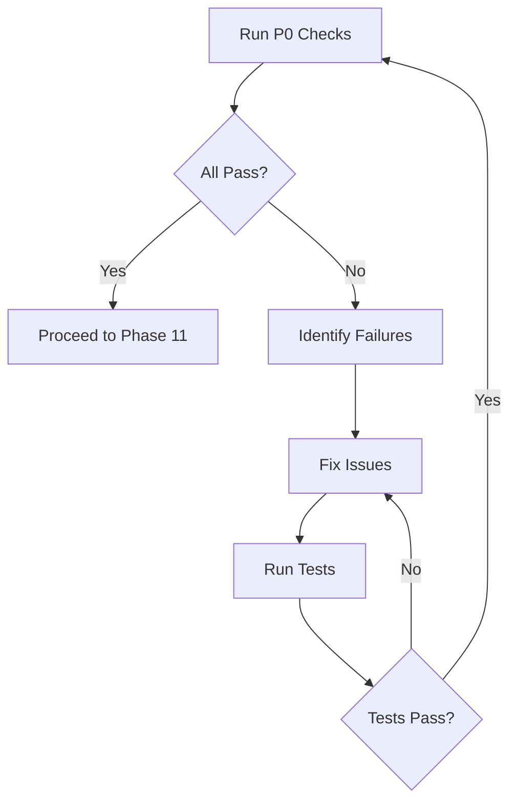

# P0 Compliance Validation Protocol

**Quick validation commands and pass/fail criteria for Brutus plugin P0 requirements.**

---

## Quick Validation Script

Run all P0 checks at once:

```bash
#!/bin/bash
PROTOCOL=$1
BRUTUS_ROOT="${BRUTUS_ROOT:-$(pwd)}"

echo "=== P0 Compliance Check for $PROTOCOL ==="

# 1. Plugin Interface
echo -n "1. Plugin Interface: "
if grep -q "func.*Plugin.*Name\(\)" "$BRUTUS_ROOT/internal/plugins/$PROTOCOL/$PROTOCOL.go" && \
   grep -q "func.*Plugin.*Test\(" "$BRUTUS_ROOT/internal/plugins/$PROTOCOL/$PROTOCOL.go"; then
    echo "PASS"
else
    echo "FAIL"
fi

# 2. Error Classification
echo -n "2. Error Classification: "
if grep -q "func classifyError" "$BRUTUS_ROOT/internal/plugins/$PROTOCOL/$PROTOCOL.go"; then
    echo "PASS"
else
    echo "FAIL"
fi

# 3. Self-Registration
echo -n "3. Self-Registration: "
if grep -q "brutus.Register" "$BRUTUS_ROOT/internal/plugins/$PROTOCOL/$PROTOCOL.go"; then
    echo "PASS"
else
    echo "FAIL"
fi

# 4. Import Registration
echo -n "4. Import Registration: "
if grep -q "$PROTOCOL" "$BRUTUS_ROOT/internal/plugins/init.go"; then
    echo "PASS"
else
    echo "FAIL"
fi

# 5. Default Port
echo -n "5. Default Port: "
if grep -q "func parseTarget" "$BRUTUS_ROOT/internal/plugins/$PROTOCOL/$PROTOCOL.go"; then
    echo "PASS"
else
    echo "FAIL"
fi

# 6. Unit Tests
echo -n "6. Unit Tests: "
TEST_COUNT=$(grep -c "func Test" "$BRUTUS_ROOT/internal/plugins/$PROTOCOL/${PROTOCOL}_test.go" 2>/dev/null || echo 0)
if [ "$TEST_COUNT" -ge 4 ]; then
    echo "PASS ($TEST_COUNT tests)"
else
    echo "FAIL ($TEST_COUNT tests, need 4+)"
fi

# 7. Test Coverage
echo -n "7. Test Coverage: "
cd "$BRUTUS_ROOT"
COVERAGE=$(go test -coverprofile=/tmp/coverage.out ./internal/plugins/$PROTOCOL/... 2>/dev/null && \
           go tool cover -func=/tmp/coverage.out | grep total | awk '{print $3}' | tr -d '%')
if [ "$(echo "$COVERAGE >= 80" | bc)" -eq 1 ]; then
    echo "PASS ($COVERAGE%)"
else
    echo "FAIL ($COVERAGE%, need 80%+)"
fi

# 8. Linting
echo -n "8. golangci-lint: "
if golangci-lint run ./internal/plugins/$PROTOCOL/... 2>/dev/null; then
    echo "PASS"
else
    echo "FAIL"
fi

echo "=== End P0 Check ==="
```

---

## Individual Check Commands

### 1. Plugin Interface

```bash
# Check Name() method
grep -n "func.*Plugin.*Name\(\)" internal/plugins/{protocol}/{protocol}.go

# Check Test() method signature
grep -n "func.*Plugin.*Test\(ctx context.Context" internal/plugins/{protocol}/{protocol}.go
```

**Pass:** Both methods found with correct signatures.

---

### 2. Error Classification

```bash
# Check function exists
grep -n "func classifyError" internal/plugins/{protocol}/{protocol}.go

# Check auth failure handling
grep -A 30 "func classifyError" internal/plugins/{protocol}/{protocol}.go | grep -E "return nil|authFailure"
```

**Pass:** Function exists and returns nil for auth failures.

---

### 3. Self-Registration

```bash
# Check init() function
grep -n "func init()" internal/plugins/{protocol}/{protocol}.go

# Check brutus.Register call
grep -n 'brutus.Register("{protocol}"' internal/plugins/{protocol}/{protocol}.go
```

**Pass:** init() contains brutus.Register() with correct protocol name.

---

### 4. Import Registration

```bash
# Check import in init.go
grep "{protocol}" internal/plugins/init.go
```

**Pass:** Import line found: `_ "github.com/praetorian-inc/brutus/internal/plugins/{protocol}"`

---

### 5. Default Port Handling

```bash
# Check parseTarget function
grep -A 10 "func parseTarget" internal/plugins/{protocol}/{protocol}.go

# Verify default port constant
grep -E "const.*Port|Default.*Port" internal/plugins/{protocol}/{protocol}.go
```

**Pass:** parseTarget() adds default port when not specified.

---

### 6. Unit Tests

```bash
# Count test functions
grep -c "func Test" internal/plugins/{protocol}/{protocol}_test.go

# List required tests
grep -E "TestPlugin_Name|TestClassifyError|ContextCancellation|ConnectionError" \
    internal/plugins/{protocol}/{protocol}_test.go
```

**Pass:** At least 4 test functions, including Name and error tests.

---

### 7. Test Coverage

```bash
# Run tests with coverage
go test -coverprofile=coverage.out ./internal/plugins/{protocol}/...

# Show coverage summary
go tool cover -func=coverage.out | grep total

# Generate HTML report (optional)
go tool cover -html=coverage.out -o coverage.html
```

**Pass:** Total coverage >= 80.0%

---

### 8. Linting

```bash
# Run golangci-lint
golangci-lint run ./internal/plugins/{protocol}/...

# With verbose output
golangci-lint run -v ./internal/plugins/{protocol}/...
```

**Pass:** No errors or warnings.

---

## Common Failures and Fixes

### "Name() not found"

**Cause:** Method not implemented or wrong receiver type.

**Fix:**
```go
func (p *Plugin) Name() string {
    return "{protocol}"
}
```

### "classifyError() missing auth patterns"

**Cause:** Auth failure indicators not comprehensive.

**Fix:** Research protocol-specific auth failure messages and add to patterns.

### "Coverage below 80%"

**Cause:** Missing test cases for error paths.

**Fix:** Add table-driven tests for all error classification scenarios.

### "golangci-lint errors"

**Common issues:**
- `errcheck`: Unhandled errors - add `if err != nil` checks
- `ineffassign`: Unused assignments - remove or use
- `staticcheck`: Code quality - follow suggestions

---

## P0 Remediation Flow



---

## Related References

- [Phase 10: Domain Compliance](phase-10-domain-compliance.md) - Full compliance checklist
- [Phase 8: Implementation](phase-8-implementation.md) - Returns here for fixes
