# Porting Python Capabilities to Go

**Orchestration skill for structured Python-to-Go porting workflows with blocking gates.**

## When to Use

Use this skill when:

- Porting Python security capabilities to Go
- Called by `orchestrating-capability-development` with work type = 'porting'
- Need systematic dependency mapping, idiom translation, and verification
- Require structured output artifacts for review

**You MUST use TodoWrite** to track progress through all phases.

## Quick Reference

| Phase | Purpose                  | Gate                              |
| ----- | ------------------------ | --------------------------------- |
| 0     | Setup output directory   | Directory created with MANIFEST   |
| 1     | Dependency mapping       | All deps mapped to Go equivalents |
| 2     | Idiom translation        | All idioms documented             |
| 3     | Equivalence verification | Behavioral parity confirmed       |

---

## Required Sub-Skills

**MANDATORY**: Invoke these skills in order. Do NOT skip or reorder.

| Phase | Required Sub-Skills                 | Conditional Sub-Skills |
| ----- | ----------------------------------- | ---------------------- |
| 0     | `persisting-agent-outputs`          | -                      |
| 1     | `mapping-python-dependencies-to-go` | -                      |
| 2     | `translating-python-idioms-to-go`   | -                      |
| 3     | `verifying-port-equivalence`        | -                      |

---

## Workflow Overview

```dot
digraph porting_workflow {
    rankdir=TB;
    node [shape=box, style=rounded];

    Start [label="User: Port Python capability X to Go", shape=doublecircle];
    Phase0 [label="Phase 0: Setup\n• Create OUTPUT_DIR\n• Validate Python source\n• Initialize MANIFEST.yaml\n\nREQUIRED SUB-SKILL: persisting-agent-outputs\n\nGate Checklist:\n[ ] OUTPUT_DIR exists\n[ ] Python source accessible\n[ ] MANIFEST.yaml created"];

    Gate0 [label="BLOCKING GATE", shape=diamond, style=filled, fillcolor=red, fontcolor=white];

    Phase1 [label="Phase 1: Dependency Mapping\n• Analyze Python imports\n• Map to Go equivalents\n• Document unmappable deps\n\nREQUIRED SUB-SKILL: mapping-python-dependencies-to-go\n\nGate Checklist:\n[ ] All imports analyzed\n[ ] Go equivalents identified\n[ ] dependency-mapping.md created"];

    Gate1 [label="BLOCKING GATE", shape=diamond, style=filled, fillcolor=red, fontcolor=white];

    Phase2 [label="Phase 2: Idiom Translation\n• Identify Python patterns\n• Document Go equivalents\n• Create translation guide\n\nREQUIRED SUB-SKILL: translating-python-idioms-to-go\n\nGate Checklist:\n[ ] All idioms cataloged\n[ ] Go patterns documented\n[ ] idiom-translation-guide.md created"];

    Gate2 [label="BLOCKING GATE", shape=diamond, style=filled, fillcolor=red, fontcolor=white];

    Phase3 [label="Phase 3: Equivalence Verification\n• Execute test cases\n• Compare outputs\n• Document differences\n\nREQUIRED SUB-SKILL: verifying-port-equivalence\n\nGate Checklist:\n[ ] All test cases pass\n[ ] Behavioral parity confirmed\n[ ] equivalence-report.md created"];

    Gate3 [label="FINAL GATE", shape=diamond, style=filled, fillcolor=green, fontcolor=white];

    Complete [label="Port Complete\nAll artifacts in OUTPUT_DIR", shape=doublecircle];

    Start -> Phase0;
    Phase0 -> Gate0 [label="Outputs ready?"];
    Gate0 -> Phase1 [label="PASS"];
    Gate0 -> Phase0 [label="FAIL", style=dashed, color=red];

    Phase1 -> Gate1 [label="Dependencies mapped?"];
    Gate1 -> Phase2 [label="PASS"];
    Gate1 -> Phase1 [label="FAIL", style=dashed, color=red];

    Phase2 -> Gate2 [label="Idioms translated?"];
    Gate2 -> Phase3 [label="PASS"];
    Gate2 -> Phase2 [label="FAIL", style=dashed, color=red];

    Phase3 -> Gate3 [label="Equivalent behavior?"];
    Gate3 -> Complete [label="PASS"];
    Gate3 -> Phase3 [label="FAIL", style=dashed, color=red];
}
```



---

## Phase 0: Setup

**REQUIRED SUB-SKILL:** `persisting-agent-outputs`

### 0.1 Create Output Directory

```bash
# Invoke persisting-agent-outputs to get directory structure
Read(".claude/skills/persisting-agent-outputs/SKILL.md")
```

**Output directory structure:**

```
.claude/.output/ports/{TIMESTAMP}-{capability-name}/
├── MANIFEST.yaml
├── metadata.json
└── (phase outputs created later)
```

### 0.2 Validate Python Source

Ask user via AskUserQuestion:

```
Where is the Python capability source code located?

Options:
1. modules/chariot-aegis-capabilities/python/
2. modules/janus/python/
3. Other path (specify)
```

Verify path exists:

```bash
ls {python-source-path}
```

### 0.3 Initialize MANIFEST.yaml

Create MANIFEST.yaml with workflow metadata:

```yaml
workflow: porting-python-capabilities-to-go
capability_name: { name }
python_source: { path }
started_at: { timestamp }
phases:
  - phase: 0
    name: setup
    status: completed
    artifacts: []
  - phase: 1
    name: dependency_mapping
    status: pending
    artifacts: []
  - phase: 2
    name: idiom_translation
    status: pending
    artifacts: []
  - phase: 3
    name: equivalence_verification
    status: pending
    artifacts: []
```

**Gate Checklist:**

- [ ] OUTPUT_DIR exists at `.claude/.output/ports/{TIMESTAMP}-{capability-name}/`
- [ ] Python source path validated and accessible
- [ ] MANIFEST.yaml created with all phases

**BLOCKING GATE**: Cannot proceed to Phase 1 until all checklist items complete.

---

## Phase 1: Dependency Mapping

**REQUIRED SUB-SKILL:** `mapping-python-dependencies-to-go`

### 1.1 Invoke Dependency Mapping Skill

```
Read(".claude/skill-library/development/capabilities/mapping-python-dependencies-to-go/SKILL.md")
```

Provide inputs:

- Python source path
- OUTPUT_DIR from Phase 0

### 1.2 Verify Dependency Mapping Output

Check for `dependency-mapping.md` in OUTPUT_DIR:

```bash
ls .claude/.output/ports/{TIMESTAMP}-{capability-name}/dependency-mapping.md
```

**Expected content structure:**

```markdown
# Dependency Mapping: {capability-name}

## Python Dependencies

### Standard Library

- `requests` → Go: `net/http` + `io`
- `json` → Go: `encoding/json`

### Third-Party

- `boto3` → Go: `github.com/aws/aws-sdk-go-v2`

### Unmappable

- `some-niche-lib` → No direct Go equivalent (requires custom implementation)
```

### 1.3 Update MANIFEST.yaml

Update Phase 1 status:

```yaml
phases:
  - phase: 1
    name: dependency_mapping
    status: completed
    artifacts:
      - dependency-mapping.md
```

**Gate Checklist:**

- [ ] All Python imports analyzed
- [ ] Go equivalents identified (or marked unmappable)
- [ ] `dependency-mapping.md` created in OUTPUT_DIR
- [ ] MANIFEST.yaml updated with Phase 1 completion

**BLOCKING GATE**: Cannot proceed to Phase 2 until all checklist items complete.

---

## Phase 2: Idiom Translation

**REQUIRED SUB-SKILL:** `translating-python-idioms-to-go`

### 2.1 Invoke Idiom Translation Skill

```
Read(".claude/skill-library/development/capabilities/translating-python-idioms-to-go/SKILL.md")
```

Provide inputs:

- Python source path
- `dependency-mapping.md` from Phase 1
- OUTPUT_DIR from Phase 0

### 2.2 Verify Idiom Translation Output

Check for `idiom-translation-guide.md` in OUTPUT_DIR:

```bash
ls .claude/.output/ports/{TIMESTAMP}-{capability-name}/idiom-translation-guide.md
```

**Expected content structure:**

````markdown
# Idiom Translation Guide: {capability-name}

## List Comprehensions

**Python:**

```python
results = [process(x) for x in items if x.valid]
```
````

**Go:**

```go
var results []Result
for _, x := range items {
    if x.Valid {
        results = append(results, process(x))
    }
}
```

## Context Managers

**Python:**

```python
with open(file) as f:
    data = f.read()
```

**Go:**

```go
f, err := os.Open(file)
if err != nil {
    return err
}
defer f.Close()
data, err := io.ReadAll(f)
```

````

### 2.3 Update MANIFEST.yaml

Update Phase 2 status:

```yaml
phases:
  - phase: 2
    name: idiom_translation
    status: completed
    artifacts:
      - idiom-translation-guide.md
````

**Gate Checklist:**

- [ ] All Python idioms cataloged (comprehensions, context managers, decorators, etc.)
- [ ] Go equivalent patterns documented with code examples
- [ ] `idiom-translation-guide.md` created in OUTPUT_DIR
- [ ] MANIFEST.yaml updated with Phase 2 completion

**BLOCKING GATE**: Cannot proceed to Phase 3 until all checklist items complete.

---

## Phase 3: Equivalence Verification

**REQUIRED SUB-SKILL:** `verifying-port-equivalence`

### 3.1 Invoke Equivalence Verification Skill

```
Read(".claude/skill-library/development/capabilities/verifying-port-equivalence/SKILL.md")
```

Provide inputs:

- Python source path
- Go implementation path
- Test cases (from Python or new)
- All prior outputs (dependency-mapping.md, idiom-translation-guide.md)
- OUTPUT_DIR from Phase 0

### 3.2 Verify Equivalence Report

Check for `equivalence-report.md` in OUTPUT_DIR:

```bash
ls .claude/.output/ports/{TIMESTAMP}-{capability-name}/equivalence-report.md
```

**Expected content structure:**

```markdown
# Equivalence Report: {capability-name}

## Test Cases

### Test Case 1: Basic Functionality

**Input:** {test input}
**Python Output:** {result}
**Go Output:** {result}
**Status:** ✅ PASS

### Test Case 2: Error Handling

**Input:** {invalid input}
**Python Output:** {error message}
**Go Output:** {error message}
**Status:** ✅ PASS

## Summary

- Total Tests: 15
- Passed: 15
- Failed: 0
- **Behavioral Equivalence:** CONFIRMED
```

### 3.3 Update MANIFEST.yaml

Update Phase 3 status and mark workflow complete:

```yaml
phases:
  - phase: 3
    name: equivalence_verification
    status: completed
    artifacts:
      - equivalence-report.md
completed_at: { timestamp }
status: success
```

**Gate Checklist:**

- [ ] All test cases executed (Python and Go)
- [ ] Output comparisons documented
- [ ] Behavioral parity confirmed (or differences explained)
- [ ] `equivalence-report.md` created in OUTPUT_DIR
- [ ] MANIFEST.yaml updated with workflow completion

**FINAL GATE**: Port complete when all checklist items pass.

---

## Output Artifacts

**All artifacts written to:**

```
.claude/.output/ports/{TIMESTAMP}-{capability-name}/
├── MANIFEST.yaml                  # Workflow metadata and status
├── metadata.json                  # Structured metadata (timestamps, phases)
├── dependency-mapping.md          # Phase 1 output
├── idiom-translation-guide.md     # Phase 2 output
└── equivalence-report.md          # Phase 3 output
```

---

## Key Principles

1. **Blocking Gates**: Cannot skip phases or proceed with incomplete outputs
2. **Skill Invocation Pattern**: Use Read tool for library skills (not Task tool for agents)
3. **TodoWrite Mandatory**: Track all phases in real-time
4. **Structured Outputs**: All artifacts follow `persisting-agent-outputs` format
5. **No Shortcuts**: Even under time pressure, complete all phases

---

## Integration

### Called By

- `orchestrating-capability-development` (when work type = 'porting')

### Requires (invoke before starting)

| Skill                      | When  | Purpose                     |
| -------------------------- | ----- | --------------------------- |
| `persisting-agent-outputs` | Start | Create OUTPUT_DIR structure |

### Calls (during execution)

| Skill                               | Phase   | Purpose                            |
| ----------------------------------- | ------- | ---------------------------------- |
| `mapping-python-dependencies-to-go` | Phase 1 | Analyze deps and map to Go         |
| `translating-python-idioms-to-go`   | Phase 2 | Catalog Python idioms, Go patterns |
| `verifying-port-equivalence`        | Phase 3 | Confirm behavioral equivalence     |

### Spawns

None - this skill invokes library skills via Read tool, not agents via Task tool.

---

## Common Rationalizations (Blocked)

| Rationalization                            | Counter                                              |
| ------------------------------------------ | ---------------------------------------------------- |
| "I already know the dependencies"          | Document them in dependency-mapping.md anyway        |
| "Idioms are obvious, skip Phase 2"         | Document explicitly for reviewers                    |
| "Go version works, skip verification"      | Equivalence must be PROVEN, not assumed              |
| "Time pressure, just port the code"        | Incomplete ports create technical debt               |
| "I already started, don't want to restart" | Sunk cost fallacy - incomplete port costs more later |
| "80% done inline, just finish it"          | 80% wrong is worse than 0% right - start over        |

**Not even when:**

- Senior says "just translate it quickly"
- Deadline is tomorrow
- Python version is "simple"
- You've ported similar capabilities before

**Always complete all three phases with gates.**

---

## Related Skills

| Skill                                  | Access Method                                                                                                    | Purpose                                     |
| -------------------------------------- | ---------------------------------------------------------------------------------------------------------------- | ------------------------------------------- |
| `orchestrating-capability-development` | `Read(".claude/skill-library/development/capabilities/orchestrating-capability-development/SKILL.md")` (LIBRARY) | Parent orchestrator for all capability work |
| `persisting-agent-outputs`             | `skill: "persisting-agent-outputs"` (CORE)                                                                       | Output directory structure                  |
| `mapping-python-dependencies-to-go`    | `Read(".claude/skill-library/development/capabilities/mapping-python-dependencies-to-go/SKILL.md")`              | Phase 1: Dependency analysis                |
| `translating-python-idioms-to-go`      | `Read(".claude/skill-library/development/capabilities/translating-python-idioms-to-go/SKILL.md")`                | Phase 2: Idiom catalog                      |
| `verifying-port-equivalence`           | `Read(".claude/skill-library/development/capabilities/verifying-port-equivalence/SKILL.md")`                     | Phase 3: Behavioral verification            |
