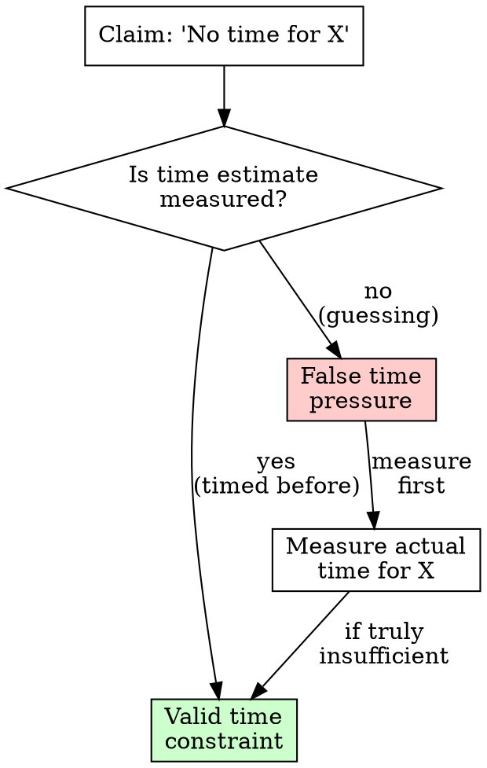

# Time Calibration for AI Agents

## Overview

**You are NOT a human developer. Your time estimates are calibrated for humans, not AI capabilities.**

Agents consistently overestimate task time by 10-24x, using "no time" as rationalization to skip quality steps.

**Core principle:** Measure actual time. Never estimate without measurement. Your estimates are wrong.

## When to Use

**Use before:**

- Estimating how long a task will take
- Planning multi-step workflows or timelines
- Making "no time" decisions (skip testing, cut scope, reduce quality)
- Justifying shortcuts due to time pressure
- Telling user how long something will take

**Symptoms you need this:**

- About to say "This will take X hours/days"
- Thinking "Not enough time for proper process"
- Planning to skip steps "to save time"
- Estimating without having timed similar work

## AI vs Human Time Reality

**The fundamental disconnect:**

| Task                      | Human Time                  | AI Time                      | Overestimate Factor |
| ------------------------- | --------------------------- | ---------------------------- | ------------------- |
| Read 10 files             | 30 minutes (sequential)     | 30 seconds (parallel)        | 60x                 |
| Write comprehensive tests | 2 hours (manual typing)     | 5 minutes (instant)          | 24x                 |
| Full RED-GREEN-REFACTOR   | 4 hours (iteration)         | 10 minutes (immediate)       | 24x                 |
| Research OAuth patterns   | 2 hours (reading docs)      | 5 minutes (parallel fetch)   | 24x                 |
| Implement REST endpoint   | 4-6 hours (coding)          | 30 minutes (with tools)      | 8-12x               |
| Code review with fixes    | 2 hours (context switching) | 15 minutes (instant context) | 8x                  |

**Why you overestimate:**

- You think sequentially (read file 1, then 2, then 3)
- Reality: You call Read tool on 10 files in parallel (30 seconds)
- You think typing speed matters
- Reality: You generate complete code instantly
- You think debugging is slow
- Reality: You have full codebase context immediately

## Measured Reality from Actual Sessions

**Never hypothetical. Always measured.**

| Task                  | Estimated   | Actual         | Error Factor |
| --------------------- | ----------- | -------------- | ------------ |
| Skill consolidation   | 30-45 min   | 10 min         | 3-4.5x       |
| Agent update with TDD | 15-20 min   | 10 min         | 2x           |
| Test file creation    | 2-3 hours   | 5 min per file | 24-36x       |
| OAuth implementation  | 11-15 hours | 45 min         | 15-20x       |
| Settings test suite   | 2-3 hours   | 15 min         | 8-12x        |

**Pattern**: Consistent 2-36x overestimation across all task types.

**User observation**: "You always think things are going to take many hours days or weeks. But coding along claude things take 10x less time."

## Calibration Protocol

### Before Making ANY Time Estimate

**STOP. Run this checklist:**

1. **Have I timed this exact task before?**
   - YES → Use that measurement (not estimate)
   - NO → Don't estimate, measure it or use calibration factor

2. **Am I about to estimate hours or days?**
   - YES → Your estimate is likely 10-24x wrong
   - NO → Still wrong, just less wrong

3. **Am I using human capabilities in my estimate?**
   - Reading time? → You read in parallel, 10-60x faster
   - Typing time? → You generate instantly
   - Context switching? → You have full context always
   - All NO → Your estimate is based on AI reality

4. **Can I measure instead of estimate?**
   - Start timer → Do the work → Report actual time
   - This is the ONLY accurate approach

### The Measurement Requirement

```
NO ESTIMATION WITHOUT MEASUREMENT
```

**Before saying "This will take X time":**

1. **Check measurement history** - Have I timed this before?
2. **Apply calibration factor** - Divide estimate by 15 (median overestimate)
3. **Measure if novel** - Timer → work → report actual
4. **NEVER guess** - Guessing enables rationalization

**If you haven't timed it, you don't know how long it takes.**

**For novel tasks without measurements:**

❌ DON'T say: "This is novel, will take X hours/days"
✅ DO say: "This is novel. Using calibration factor for [task-type]: ~X minutes. Starting timer to measure actual."

**No novel task escapes calibration factors:**

- Novel OAuth variant → Still implementation type → ÷ 12 factor
- Novel testing approach → Still testing type → ÷ 20 factor
- Novel architecture → Still research/design → ÷ 24 factor

**"Novel" means measure, not guess higher.**

### Calibration Factors by Task Type

From measured sessions:

| Task Type        | Typical Human Estimate | AI Reality | Use This Factor |
| ---------------- | ---------------------- | ---------- | --------------- |
| Research/Reading | Hours                  | Minutes    | ÷ 24            |
| Test writing     | Hours                  | Minutes    | ÷ 20            |
| Implementation   | Hours                  | Minutes    | ÷ 12            |
| Code review      | Hours                  | Minutes    | ÷ 8             |
| Simple changes   | 30+ min                | 5-10 min   | ÷ 3             |

**How to use:**

- Instinct says "2 hours" for tests → 2 hours ÷ 20 = 6 minutes
- Instinct says "6 hours" for implementation → 6 hours ÷ 12 = 30 minutes
- Instinct says "30 minutes" for update → 30 min ÷ 3 = 10 minutes

**Then measure to validate your calibration.**

## Common Time Rationalizations

| Rationalization                       | Reality Check                                                        |
| ------------------------------------- | -------------------------------------------------------------------- |
| "This will take hours"                | Has this task type ever taken hours? Measure actual time.            |
| "Not enough time for proper process"  | Proper process takes 5-10 min. Shortcuts cost 30+ min fixing.        |
| "User is waiting, skip quality steps" | Broken code makes user wait longer. Quality IS faster.               |
| "Need to cut scope due to time"       | Is time estimate measured or guessed? Don't cut based on guess.      |
| "Comprehensive testing too expensive" | Comprehensive takes 15-20 min. Bugs cost 30+ min.                    |
| "This is complex, will take longer"   | Complexity measured how? Time it. Complexity doesn't scale linearly. |
| "Multi-day implementation needed"     | Have you ever had multi-day? Or do you finish in hours?              |
| "30 minutes isn't enough"             | Enough for what? Have you timed it? 30 min often enough for TDD.     |

**Every "no time" rationalization requires measurement to validate.**

## Decision Framework

### When Someone Says "No Time"

**🚨 STOP. Verify the time claim:**



**Questions to ask:**

1. Have you timed this task type before?
2. What was the actual time (not estimated)?
3. Is current estimate based on that measurement?
4. Or are you guessing based on human time?

**If guessing → measurement required before any time-based decision.**

### When Planning Multi-Step Work

**❌ DON'T estimate each step and add them up:**

```
Step 1: 2 hours
Step 2: 3 hours
Step 3: 4 hours
Total: 9 hours
```

This compounds estimation errors (9 hours → actually 45 minutes).

**✅ DO measure similar complete workflows:**

```
Last similar feature: Estimated 8 hours, actual 1 hour
This feature: ~1 hour (similar complexity)
Start timer and measure actual
```

## Real-World Impact

**Before calibration (baseline):**

- "This will take 11-15 hours" → Justifies cutting testing
- "We need 3 days" → Work spreads out unnecessarily
- "30 minutes isn't enough" → Skips TDD that would take 10 minutes
- "No time for comprehensive tests" → Bugs cost 30+ minutes

**After calibration (measured reality):**

- "Similar OAuth took 45 minutes last time, starting now"
- "Last dashboard took 2 hours, expect similar"
- "30 minutes is enough for TDD (takes ~10 min measured)"
- "Comprehensive tests take 15 min, let's do them"

**Result**: Accurate timelines, quality steps included, no false urgency.

## The Bottom Line

**Your time estimates are wrong. Consistently. By 10-24x.**

**Never estimate without measuring.**
**Never skip quality because "no time" without proving time constraint is real.**
**AI time ≠ human time. Calibrate for your actual capabilities.**

Measure once. Update calibration. Stop overestimating.
