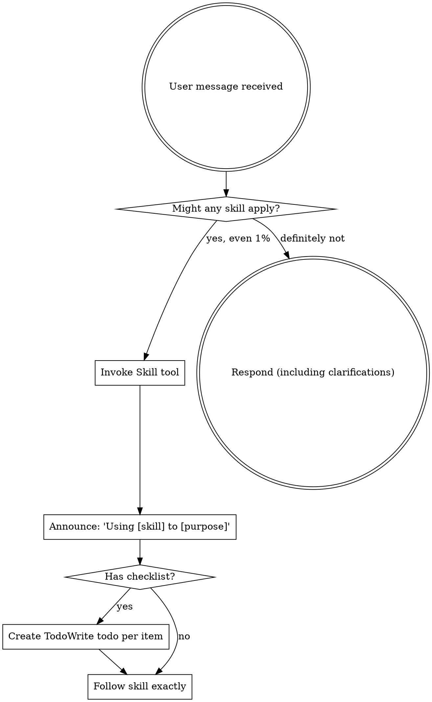

<EXTREMELY-IMPORTANT>
If you think there is even a 1% chance a skill might apply to what you are doing, you ABSOLUTELY MUST invoke the skill.

IF A SKILL APPLIES TO YOUR TASK, YOU DO NOT HAVE A CHOICE. YOU MUST USE IT.

This is not negotiable. This is not optional. You cannot rationalize your way out of this.
</EXTREMELY-IMPORTANT>

## How to Access Skills

- **Core skills** (in `.claude/skills/`): Invoke via Skill tool → `skill: "skill-name"`
- **Gateway Skills** (in `.claude/skills/`): Invoke via Skill tool → `skill: "gateway-name"`

**ALWAYS read your gateway skills to locate task relevant skills. You MUST follow the gateway's instructions.** It tells you which library skills to load.

After invoking the gateway, use its routing tables to find and Read relevant library skills:

- **Library skills** (in `.claude/skill-library/`): Load via Read tool → `Read("path/from/gateway")`

# Using Skills

## The Rule

**Invoke relevant or requested skills BEFORE any response or action.** Even a 1% chance a skill might apply means that you should invoke the skill to check. If an invoked skill turns out to be wrong for the situation, you don't need to use it.



## Red Flags

These thoughts mean STOP—you're rationalizing:

| Thought                             | Reality                                                                 |
| ----------------------------------- | ----------------------------------------------------------------------- |
| "This is just a simple question"    | Questions are tasks. Check for skills.                                  |
| "I need more context first"         | Skill check comes BEFORE clarifying questions.                          |
| "Let me explore the codebase first" | Skills tell you HOW to explore. Check first.                            |
| "I can check git/files quickly"     | Files lack conversation context. Check for skills.                      |
| "Let me gather information first"   | Skills tell you HOW to gather information.                              |
| "This doesn't need a formal skill"  | If a skill exists, use it.                                              |
| "I remember this skill"             | Skills evolve. Read current version.                                    |
| "This doesn't count as a task"      | Action = task. Check for skills.                                        |
| "The skill is overkill"             | Simple things become complex. Use it.                                   |
| "I'll just do this one thing first" | Check BEFORE doing anything.                                            |
| "This feels productive"             | Undisciplined action wastes time. Skills prevent this.                  |
| "I know what that means"            | Knowing the concept ≠ using the skill. Invoke it.                       |
| "I'm done, no need to verify"       | Completion claims require evidence. Invoke verifying-before-completion. |
| "Tests pass so requirements met"    | Tests ≠ requirements. Verify exit criteria separately.                  |

## Skill Priority

When multiple skills could apply, use this order:

1. **Process skills first** (brainstorming, debugging) - these determine HOW to approach the task
2. **Implementation skills second** (orchestrating-mcp-development, implementing-go-semaphore-pools) - these guide execution

"Let's build X" → brainstorming first, then implementation skills.
"Fix this bug" → debugging first, then domain-specific skills.

## Completion Skills

**Before claiming ANY task complete, check for completion skills:**

| About to...                        | Required Skill                |
| ---------------------------------- | ----------------------------- |
| Claim task/phase complete          | `verifying-before-completion` |
| Mark batch done                    | `verifying-before-completion` |
| Say 'done', 'finished', 'complete' | `verifying-before-completion` |
| Create commit/PR                   | `verifying-before-completion` |
| Return from subagent task          | `verifying-before-completion` |

**The completion trap:**

```
❌ WRONG: 'I updated all 118 files. Done!'
   (No verification - how do you KNOW it's 118?)

✅ RIGHT: [Invoke verifying-before-completion]
   'Exit criteria: 118 files. Verified: grep shows 118 files updated.'
```

**Completion is a task.** It requires skill invocation like any other task.

## Skill Types

**Rigid** (TDD, debugging): Follow exactly. Don't adapt away discipline.

**Flexible** (patterns): Adapt principles to context.

The skill itself tells you which.

## User Instructions

Instructions say WHAT, not HOW. "Add X" or "Fix Y" doesn't mean skip workflows.

## Integration

### Called By

- Session start hooks (`session-start.sh`, `user-prompt-submit.sh`)
- CLAUDE.md project instructions (referenced at top of file)
- All agents (foundational skill for skill discovery)

### Requires (invoke before starting)

None - Entry point skill providing skill access framework

### Calls (during execution)

This skill provides the framework for calling other skills but doesn't invoke specific skills itself. It instructs agents to:

- Use `Skill()` tool for core skills in `.claude/skills/`
- Use `Read()` tool for library skills in `.claude/skill-library/`
- Use gateway skills to discover library skills

### Pairs With (conditional)

| Skill                         | Trigger                       | Purpose                       |
| ----------------------------- | ----------------------------- | ----------------------------- |
| All skills                    | Every task                    | Provides discovery framework  |
| Gateway skills                | Task requires library skill   | Route to appropriate domain   |
| `verifying-before-completion` | Before claiming task complete | Prevents premature completion |
| `brainstorming`               | "Let's build X"               | Process skills come first     |
| `debugging-systematically`    | "Fix this bug"                | Process skills come first     |
