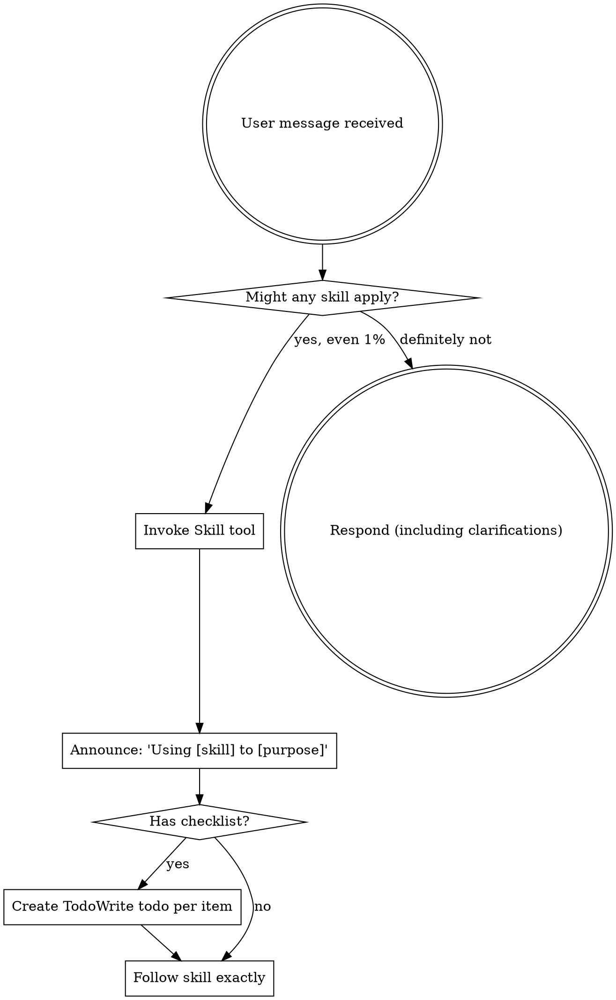

# CLAUDE.md

This file provides guidance to Claude Code (claude.ai/code) when working with code in this repository.

## Project Overview

**Praetorian Guard Development Platform** is a comprehensive super-repository that unifies all Praetorian security tools and frameworks under a single development environment with integrated AI assistance. 

## Claude Code Infrastructure (.claude/)

<EXTREMELY-IMPORTANT>
If you think there is even a 1% chance a skill might apply to what you are doing, you ABSOLUTELY MUST invoke the skill.

IF A SKILL APPLIES TO YOUR TASK, YOU DO NOT HAVE A CHOICE. YOU MUST USE IT.

This is not negotiable. This is not optional. You cannot rationalize your way out of this.
</EXTREMELY-IMPORTANT>

### How to Access Skills and Tools that you are not aware of by default

#### Core Skills
- **Core skills** (in `.claude/skills/`): Invoke via Skill tool → `skill: "skill-name"`

#### Gateway Skills
- **Gateway Skills** (in `.claude/skills/`): Invoke via Skill tool → `skill: "gateway-name"`
**ALWAYS read your gateway skills to locate task relevant skills. You MUST follow the gateway's instructions.** It tells you which library skills to load.

#### Library Skills
After invoking the gateway, use its routing tables to find and Read relevant library skills:
- **Library skills** (in `.claude/skill-library/`): Load via Read tool → `Read("path/from/gateway")`

#### Tools Skills
Skill for communicating with external integrations (Chrome DevTools, Linear, Currents, Context7, etc.)
- **Tool skills** (in `.claude/tools/`): Load via Read tool → `Read("path/from/gateway")`

### Agent-First Principle

**Always check for a specialized agent before acting. You are the fallback, not the default.**

1. Task arrives → Check if a matching agent exists
2. Agent exists → Spawn it
3. No agent → Do it yourself

| Task Type | Agent (if exists) | Fallback |
|-----------|-------------------|----------|
| Backend Go code | `backend-developer` | You |
| Frontend React/TS | `frontend-developer` | You |
| Python code | (none yet) | You |
| MCP tools | `tool-developer` | You |
| Capabilities | `capability-developer` | You |
| Code review | `*-reviewer` agents | You |
| Testing | `*-tester` agents | You |

**Red Flag:** If you're about to use Edit/Write on code and a developer agent exists for that domain, STOP. Spawn the agent instead.

### Using Skills

#### The Rule

**Invoke relevant or requested skills BEFORE any response or action.** Even a 1% chance a skill might apply means that you should invoke the skill to check. If an invoked skill turns out to be wrong for the situation, you don't need to use it.



#### Red Flags

These thoughts mean STOP—you're rationalizing:

| Thought                             | Reality                                                                 |
| ----------------------------------- | ----------------------------------------------------------------------- |
| "This is just a simple question"    | Questions are tasks. Check for skills.                                  |
| "I need more context first"         | Skill check comes BEFORE clarifying questions.                          |
| "Let me explore the codebase first" | Skills tell you HOW to explore. Check first.                            |
| "I can check git/files quickly"     | Files lack conversation context. Check for skills.                      |
| "Let me gather information first"   | Skills tell you HOW to gather information.                              |
| "This doesn't need a formal skill"  | If a skill exists, use it.                                              |
| "I remember this skill"             | Skills evolve. Read current version.                                    |
| "This doesn't count as a task"      | Action = task. Check for skills.                                        |
| "The skill is overkill"             | Simple things become complex. Use it.                                   |
| "I'll just do this one thing first" | Check BEFORE doing anything.                                            |
| "This feels productive"             | Undisciplined action wastes time. Skills prevent this.                  |
| "I know what that means"            | Knowing the concept ≠ using the skill. Invoke it.                       |
| "I'm done, no need to verify"       | Completion claims require evidence. Invoke verifying-before-completion. |
| "Tests pass so requirements met"    | Tests ≠ requirements. Verify exit criteria separately.                  |
| "This is too simple for an agent"   | If an agent exists for this domain, use it. You are the fallback.       |
| "I can just make this edit myself"  | Spawn the developer agent. You coordinate, agents implement.            |

#### Skill Priority

When multiple skills could apply, use this order:

1. **Process skills first** (brainstorming, debugging) - these determine HOW to approach the task
2. **Implementation skills second** (orchestrating-mcp-development, implementing-go-semaphore-pools) - these guide execution

"Let's build X" → brainstorming first, then implementation skills.
"Fix this bug" → debugging first, then domain-specific skills.

#### Completion Skills

**Before claiming ANY task complete, check for completion skills:**

| About to...                        | Required Skill                |
| ---------------------------------- | ----------------------------- |
| Claim task/phase complete          | `verifying-before-completion` |
| Mark batch done                    | `verifying-before-completion` |
| Say 'done', 'finished', 'complete' | `verifying-before-completion` |
| Create commit/PR                   | `verifying-before-completion` |
| Return from subagent task          | `verifying-before-completion` |

**The completion trap:**

```
❌ WRONG: 'I updated all 118 files. Done!'
   (No verification - how do you KNOW it's 118?)

✅ RIGHT: [Invoke verifying-before-completion]
   'Exit criteria: 118 files. Verified: grep shows 118 files updated.'
```

**Completion is a task.** It requires skill invocation like any other task.

#### Skill Types

**Rigid** (TDD, debugging): Follow exactly. Don't adapt away discipline.

**Flexible** (patterns): Adapt principles to context.

The skill itself tells you which.

#### User Instructions

Instructions say WHAT, not HOW. "Add X" or "Fix Y" doesn't mean skip workflows.

## Repository Architecture

### Super-Repository Structure

This is a **super-repository** containing submodules organized under `/modules/`:

```
praetorian-development-platform/               # Super-repo root
├── modules/                                   # Core platform submodules
│   ├── chariot/                               # Core platform (backend API + React UI)
│   ├── chariot-ui-components/                 # Shared React component library (end-of-lifing)
│   ├── tabularium/                            # Universal data schema and models
│   ├── janus-framework/                       # Go framework for security tool chains
│   ├── janus/                                 # Tool orchestration system
│   ├── aegiscli/                              # Velociraptor-based security orchestration
│   ├── chariot-aegis-capabilities/            # VQL security capabilities
│   ├── chariot-devops/                        # DevOps and infrastructure automation
│   ├── praetorian-cli/                        # Python CLI and SDK
│   ├── praetorian-agent-workflows/            # AI agent workflow orchestration
│   └── ai-research/                           # AI security research and experiments
├── Makefile                                   # Super-repo automation
├── docs/CLEAN_CODE.md                         # Summary of 'Clean code' by Robert C. Martin
```

**Note:** Security scanning tools (nebula, fingerprintx, noseyparker, nuclei-templates, etc.) have been migrated to [praetorian-inc/capabilities](https://github.com/praetorian-inc/capabilities).

## Initial Repository Setup (First Time Only)

**Critical**: This super-repository requires recursive submodule cloning:

```bash
# Initial clone with all submodules
git clone --recurse-submodules https://github.com/praetorian-inc/praetorian-development-platform.git

# Complete setup sequence
make setup                    # Install dependencies and configure environment
make guard                  # Deploy complete Chariot stack (CloudFormation + React UI)
make user                     # Generate test user with UUID credentials
make claude-setup             # Display Claude Code plugin installation commands

# Credentials are automatically stored in .env:
# PRAETORIAN_CLI_USERNAME={uuid}@praetorian.com
# PRAETORIAN_CLI_PASSWORD={uuid-no-dashes}Aa1!

# UI will be available at https://localhost:3000 with generated credentials
```

**⚠️ IMPORTANT: Verify Git Hooks Are Installed**

After running `make setup`, verify the pre-commit hook is active:

```bash
.githooks/verify-hooks.sh
```

This hook **prevents accidental submodule commits** that cause PR conflicts. If you see a warning, run:

```bash
make install-git-hooks
```

## Essential Development Commands

### Core Platform Commands

```bash
# Complete platform deployment (REQUIRED for new development)
make guard                  # Deploy Chariot stack (CloudFormation + React UI)

# User management
make user                     # Generate test user with UUID credentials

# Submodule management
make setup                    # Initial repository setup with all dependencies
make submodule-pull           # Pull latest changes from all submodules
make checkout branch=main     # Checkout branch across all submodules
make create branch=feature-x  # Create branch across all submodules
make create-prs               # Create PRs across all submodules
```

### Module-Specific Commands

Navigate to specific modules for targeted development:

```bash
cd modules/chariot            # Main platform development
cd modules/chariot/backend && make deploy    # Deploy backend only
cd modules/chariot/ui && npm start           # Frontend development server
cd modules/chariot/e2e && npm test           # Run E2E test suite

cd modules/janus              # Security tool orchestration
cd modules/tabularium         # Data schema management
```

### Build & Testing Commands

```bash
# Backend (Go modules)
make test                     # Run Go tests across modules
go test ./...                 # Standard Go testing

# Frontend (React/TypeScript: modules/chariot/ui)
npm run build                 # Production build

# E2E Testing (Playwright: modules/chariot/e2e)
npx ts-node script/setup-test.ts --env=local-uat
npx playwright test

# Python CLI
pytest                        # Run Python test suites (in praetorian-cli)
```

## Technology Stack & Patterns

### Backend Architecture

- **Go 1.24.6**: Primary backend language across all modules
- **AWS Serverless**: Lambda functions + API Gateway + DynamoDB + Neo4j
- **Security Focus**: Attack surface management, vulnerability scanning, tool orchestration
- **Pattern**: Repository pattern with interface-based design for extensibility

### Frontend Architecture

- **React 19 + TypeScript**: Main UI framework
- **Tailwind CSS**: Styling with custom design system
- **Vite**: Build system and development server
- **TanStack Query**: Data fetching and caching
- **Pattern**: Feature-based organization with shared component library

### Key Frameworks

- **Janus Framework**: Go library for chaining security tools into workflows
- **Tabularium**: Universal data schema with code generation across languages
- **Velociraptor (VQL)**: Security capability definitions and agent coordination
- **Claude Flow**: SPARC methodology for AI-assisted development

## Development Workflows

### Submodule Commit Prevention

🚨 **CRITICAL: Never commit submodule changes in the super-repo**

Submodule changes should ONLY be committed in their respective submodule repositories, not in the super-repo.

**Git Hook Protection (Automatic):**

```bash
# Git hooks are automatically installed during setup
make setup                    # Installs pre-commit hook automatically

# Manual installation if needed
make install-git-hooks       # Install git hooks manually
```

The pre-commit hook will **block any commits** that include changes to `modules/*`, preventing accidental submodule commits.

**Working with Submodules:**

```bash
# ✅ CORRECT: Work in submodule directory
cd modules/chariot
git checkout -b feature/my-feature
# Make changes, commit, push
git commit -m "feat: add new feature"
git push origin feature/my-feature
# Create PR in chariot repository

# ❌ WRONG: Committing submodule pointer in super-repo
git add modules/chariot
git commit -m "update chariot"  # This will be BLOCKED by pre-commit hook
```

**If You Accidentally Committed Submodule Changes:**

```bash
# Unstage submodule changes
git restore --staged modules/*

# If already committed, use filter-branch to remove from history
# (Contact team lead for assistance with this)
```

**Why This Matters:**

- Submodule pointer changes clutter the super-repo history
- They create merge conflicts across team members
- They make PRs harder to review
- Each submodule has its own independent workflow and PR process

### Branch Safety Protocol

🚨 **NEVER WORK ON MAIN BRANCH**

```bash
# 1. Sync with origin (must be in super-repo root)
git fetch origin && git merge origin/main && make submodule-pull

# 2. Create feature branch across all submodules
git checkout -b feature/your-feature-name
git submodule foreach 'git checkout -b feature/your-feature-name'
```

### File Organization Rules

- **NEVER** save working files to root folder
- **ALWAYS** organize in appropriate `/modules/` subdirectories
- **PREFER** editing existing files over creating new ones

### Deployment Protocol

**🚨 ONLY USE THIS COMMAND:**

```bash
make guard
```

**NEVER use**: `docker-compose up`, `npm start`, `go run` for full deployment

### Bash Command Simplicity

**Use simple, separate Bash commands instead of complex compound statements.**

The Claude Code Bash tool has parsing edge cases with complex chains combining `;`, `&&`, `$()`, and `|`.

```bash
# ❌ AVOID: Complex compound commands
REPO_ROOT=$(...); VAR="..."; mkdir && TIMESTAMP=$(...) && ls | tail
```

```bash
# ✅ PREFERRED: Separate commands
REPO_ROOT=$(git rev-parse --show-toplevel)
```

```bash
mkdir -p /path/to/dir
```

```bash
ls -la /path/to/dir
```

**Why:** Easier debugging, avoids parser edge cases, better progress visibility.

## Security Platform Context

### Attack Surface Management Core Concepts

```go
// Key entities across the platform
Asset       // External-facing resources (discovered via scanning)
Risk        // Security vulnerabilities and threat assessments
Attribute   // Asset properties and metadata
Seed        // Discovery starting points for asset enumeration
Job         // Async security scan operations
Capability  // Security scanning tools and orchestration
```

### Multi-Cloud Security Architecture

- **AWS/Azure/GCP**: Cloud security assessment and posture management
- **Network Security**: Port scanning, SSL analysis, DNS enumeration
- **Web Application Security**: Nuclei templates, custom vulnerability detection
- **Container Security**: Docker registry scanning, Kubernetes assessment

## Module-Specific Development Guidance

### For Core Platform Development (modules/chariot/)

- Reference: `modules/chariot/CLAUDE.md` - Detailed platform patterns
- Backend: `modules/chariot/backend/CLAUDE.md` - Go serverless architecture
- Frontend: `modules/chariot/ui/CLAUDE.md` - React TypeScript patterns

### For Security Framework Development (janus/aegiscli)

- Follow Go patterns from `docs/DESIGN-PATTERNS.md`
- Use Janus framework for tool orchestration
- Implement VQL capabilities for security operations

### For Data Schema Work (tabularium)

- Reference: `modules/tabularium/CLAUDE.md` - Schema and code generation
- Universal data models across all languages
- Automated code generation for API consistency

## Testing Strategy

### Automated Test Generation

Frontend changes automatically trigger E2E test generation:

- File patterns: `**/{ui}/**/*.{ts,tsx,js,jsx,css}`
- Tests generate automatically using Playwright fixtures
- NO PERMISSION REQUIRED for test generation

### Security Testing Patterns

- **Unit Tests**: 80%+ coverage for business logic with security focus
- **Integration Tests**: Cloud service mocking and API validation
- **E2E Tests**: Complete user security workflows
- **Capability Tests**: Security tool execution and result validation

## Graph Query Requirements

### allowedColumns Field Validation

When making queries to the Chariot graph database (Neo4j), verify fields against the **source of truth**:

- **Source file**: `modules/chariot/backend/pkg/query/allowed_columns.go`
- **Field count**: 200+ fields (grows with new entity types)
- **Validation**: Invalid fields return error `"invalid filter column: {field}"`

**Critical Rule**: Before using a field in a graph query filter, read `allowed_columns.go` to verify it exists. Do NOT rely on hardcoded lists - they drift.

**Skill Available**: Use the `constructing-graph-queries` library skill for:

- Dynamic column validation
- Query structure patterns
- Common filter examples
- Relationship traversal

**Quick Field Lookup**:

```bash
# Check if a field is allowed
grep -w "fieldname" modules/chariot/backend/pkg/query/allowed_columns.go
```

**Example Valid Graph Query**:

```json
{
  "node": {
    "labels": ["Asset"],
    "filters": [
      { "field": "status", "operator": "=", "value": "A" },
      { "field": "class", "operator": "=", "value": "ipv4" }
    ]
  },
  "limit": 100
}
```

**Module Documentation:**

- `modules/chariot/CLAUDE.md` - Core platform development workflows
- `modules/chariot/ui/e2e/CLAUDE.md` - Playwright E2E testing (fixtures, POM, environment config)
- `modules/chariot/backend/CLAUDE.md` - Lambda handlers, capabilities, SAM deployment
- `modules/chariot/ui/CLAUDE.md` - React components, state management, Vitest testing
- `modules/tabularium/CLAUDE.md` - Data schema and code generation patterns
- Individual module README files for specific implementation details

## Navigation & Context Commands

### Repository Context Verification

```bash
pwd && git remote get-url origin    # Verify current location and repository

# Navigate to super-repo root from anywhere
ROOT="$(git rev-parse --show-superproject-working-tree --show-toplevel | head -1)" && cd "$ROOT"

# Navigate to specific module
cd modules/[module-name]            # Must be in super-repo first
```

### Git Worktree Management (Advanced)

```bash
make tree-add NAME=feature-branch   # Create isolated development environment
make tree-list                      # List all active worktrees
make tree-remove NAME=feature-branch # Clean worktree removal
```

## Quality Gate Enforcement

<EXTREMELY-IMPORTANT>
### Code Modification Review Requirement

**BEFORE claiming any code change is complete, you MUST spawn reviewer and tester agents.**

This is NOT optional. This is NOT "nice to have." This is MANDATORY.

| Modified Domain | Required Agents |
|-----------------|-----------------|
| Backend (.go files in backend/, pkg/, cmd/) | `backend-reviewer`, `backend-tester` |
| Frontend (.tsx, .jsx, ui/) | `frontend-reviewer`, `frontend-tester` |
| Python (.py files) | `backend-reviewer`, `backend-tester` |
| MCP Tools (.claude/tools/) | `tool-reviewer`, `tool-tester` |
| Capabilities (VQL, Nuclei, scanners) | `capability-reviewer`, `capability-tester` |

### The Quality Gate Flow

```
1. You modify code (Edit/Write)
2. BEFORE saying "done" or "complete":
   a. Spawn the appropriate reviewer agent
   b. Spawn the appropriate tester agent
3. ONLY after both return successfully can you claim completion
```

### Red Flags - You're Skipping Quality Gates If:

| Thought | Reality |
|---------|---------|
| "This is a simple change" | All changes need review. No exceptions. |
| "I already tested it mentally" | Spawn the tester agent. |
| "The user just wants it done" | Quality gates protect the user. |
| "I'll just run `go test` myself" | Use specialized tester agents. |
| "It's just adding a function" | Reviewer checks patterns, tester validates. |

### Bypass Conditions (ONLY these)

Quality gates are automatically handled (bypass allowed) when using orchestration skills:
- `/feature` or `orchestrating-feature-development`
- `/capability` or `orchestrating-capability-development`
- `/integration` or `orchestrating-integration-development`
- `/bugfix`

These skills include review/test phases internally.

**Ad-hoc changes (direct Edit/Write without orchestration) ALWAYS require manual reviewer/tester spawning.**
</EXTREMELY-IMPORTANT>

## Critical Development Reminders

1. **Deployment**: Only use `make guard` from super-repo root for full platform
2. **Branch Safety**: Never work directly on main branch - always create feature branches
3. **File Organization**: Never save working files to root - use appropriate `/modules/` subdirectories
4. **Testing**: Frontend changes automatically generate E2E tests with Playwright
5. **Security Focus**: All development must consider attack surface implications and security best practices
6. **Concurrency**: Use Claude Code's Task tool for parallel agent execution, batch all operations in single messages
7. **Skills & Architecture**: Use skill-search CLI to discover capabilities before implementing
8. **Context Engineering**: Architecture optimized for token efficiency - use gateways for progressive loading
9. **Quality Gates**: Always spawn reviewer and tester agents after code modifications (see Quality Gate Enforcement above)

This super-repository enables unified development of comprehensive security platforms with AI-assisted workflows and automated testing.
