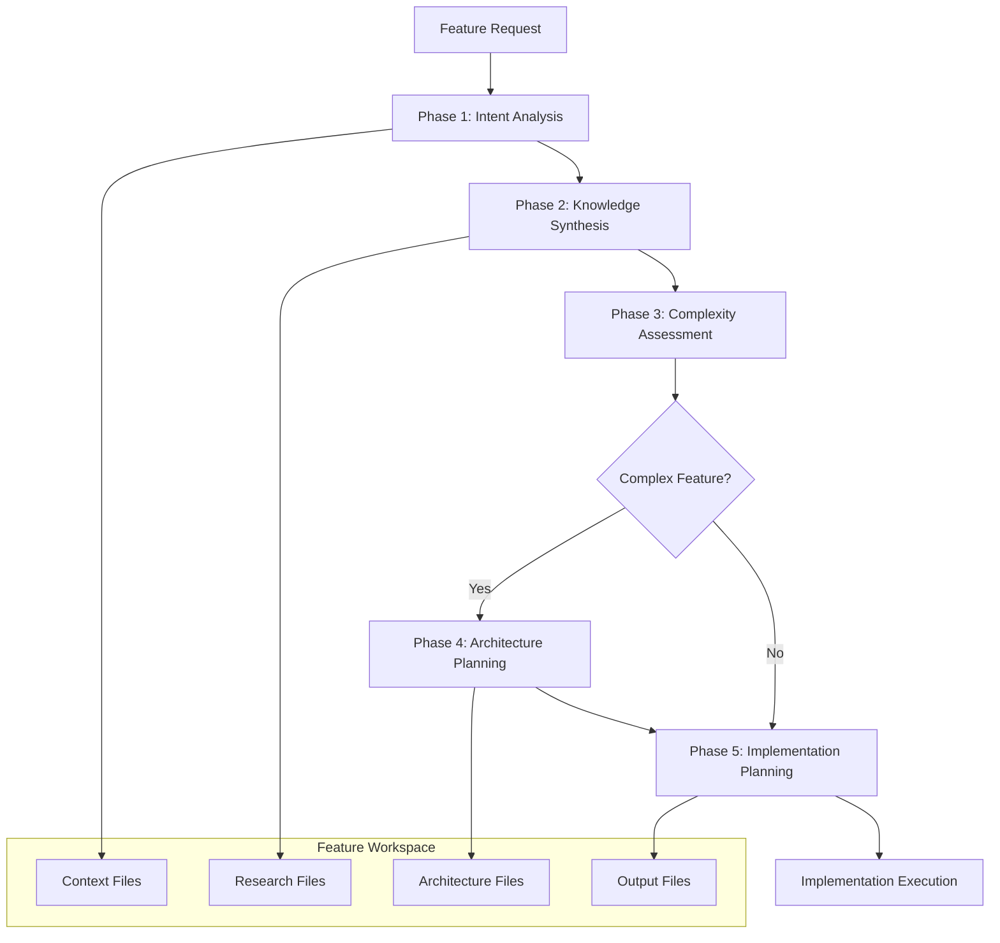

# Einstein Feature Orchestration Architecture

## Overview

The **Einstein Feature System** is a comprehensive multi-phase orchestration platform that transforms natural language feature requests into fully implemented, production-ready code. Built on Claude Code's Task tool and specialized AI agents, it provides a systematic approach to feature development through intelligent workflow orchestration.

## Architecture Philosophy

### Core Principles

1. **Systematic Orchestration**: Every feature goes through structured phases for consistent quality
2. **Agent Specialization**: Each agent has a specific expertise domain for optimal results
3. **Context Isolation**: Features get dedicated workspaces preventing interference
4. **Intelligent Research**: Automated research agents gather context before implementation
5. **Complexity-Adaptive Planning**: Different complexity levels trigger different orchestration strategies

### Workflow Integration

The system integrates with:

- **Jira Integration**: Automatic ticket resolution and preprocessing
- **Claude Code Task Tool**: Primary agent spawning mechanism
- **Chariot Development Platform**: Aligned with repository patterns and tech stack
- **SPARC Methodology**: Following structured development phases when needed

---

## System Architecture

### Multi-Phase Workflow Structure



### Agent Ecosystem

The system employs **66+ specialized agents** organized into functional categories:

#### Core Orchestration Agents

- **preprocessing-orchestration**: Handles Jira reference detection and resolution with intelligent agent routing
- **intent-translator**: Transforms vague requests into structured requirements
- **knowledge-synthesizer**: Coordinates research and consolidates findings
- **complexity-assessor**: Evaluates implementation complexity and resource needs
- **architecture-coordinator**: Manages architectural analysis for complex features
- **implementation-planner**: Creates detailed execution plans with agent assignments

#### Research & Analysis Agents

- **jira-reader**: Resolves Jira ticket references and provides context
- **context7-search-specialist**: Finds official library documentation and APIs
- **web-research-specialist**: Gathers industry best practices and current information
- **code-pattern-analyzer**: Analyzes existing codebase patterns and consistency

#### Specialized Development Agents

- **golang-api-developer**: Go backend APIs and GraphQL resolvers
- **react-developer**: React/TypeScript components and UI features
- **security-architect**: Security design patterns and threat modeling
- **go-backend-architect**: Go system architecture and performance optimization
- **react-typescript-architect**: Frontend architecture and component design

---

## Detailed Phase Analysis

### Phase 0: Preprocessing (Automatic)

**Responsible Agent**: `preprocessing-orchestration`

**Purpose**: Automatically detect and resolve Jira ticket references before main workflow execution.

**Process**:

1. **Reference Detection**:

   - Scan input for patterns like `CHA-1232`, `PROJ-123`
   - Detect Jira URLs with `atlassian.net/browse/` patterns
   - Use regex patterns: `\b[A-Z]{2,10}-\d+\b`

2. **Conditional Execution**:

   ```javascript
   if (hasJiraRefs || hasJiraUrls) {
     return sequentialExecution(); // Resolve first, then continue
   } else {
     return directExecution(); // Skip to Phase 1
   }
   ```

3. **Reference Resolution**:

   - Use `jira-reader` in preprocessing mode
   - Fetch full ticket details via Atlassian MCP tools
   - Replace references with structured content

4. **Intelligent Routing**:
   - Analyze resolved content complexity
   - Recommend appropriate next agent based on ticket details
   - Route to `intent-translator` if clarification needed
   - Route directly to implementation agents if clear

**Example Transformations**:

```
Input:  "Implement the feature from CHA-1232"
Output: "Implement the following feature: [TICKET CHA-1232: JWT Authentication System]
         Summary: Implement JWT-based authentication with MFA support
         Description: [Full ticket description...]
         Acceptance Criteria: [Detailed criteria...]"
```

### Phase 1: Intent Analysis

**Responsible Agent**: `intent-translator`

**Purpose**: Transform ambiguous user requests into precise, actionable specifications.

**Process**:

1. **Jira Preprocessing** (if references detected):
   - Detect patterns like `CHA-1232`, `PROJ-123`
   - Use `jira-reader` to fetch full ticket details
   - Replace references with structured content
2. **Requirements Decomposition**:
   - Extract functional and non-functional requirements
   - Identify assumptions and constraints
   - Create user stories and acceptance criteria
3. **Output Generation**:
   - Save structured requirements to `.claude/features/{FEATURE_ID}/context/requirements.json`

**Example Output Structure**:

```json
{
  "feature_name": "dark-mode-toggle",
  "user_stories": [...],
  "acceptance_criteria": [...],
  "affected_systems": ["frontend", "design-system"],
  "constraints": [...],
  "technical_requirements": [...]
}
```

### Phase 2: Knowledge Synthesis

**Responsible Agent**: `knowledge-synthesizer`

**Purpose**: Analyze requirements and orchestrate targeted research to gather implementation context.

**Research Strategy**:

**Third-Party Integration Pattern** (Systematic context7-first approach):

```json
{
  "recommended_research": [
    {
      "agent": "context7-search-specialist",
      "focus": "[LIBRARY] official documentation, API endpoints, authentication",
      "priority": "high",
      "reason": "Need structured official documentation first"
    },
    {
      "agent": "web-research-specialist",
      "focus": "[LIBRARY] best practices, security considerations, common pitfalls",
      "priority": "medium",
      "reason": "Supplement official docs with implementation best practices"
    },
    {
      "agent": "code-pattern-analyzer",
      "focus": "Existing [SIMILAR_INTEGRATION] patterns in codebase",
      "priority": "high",
      "reason": "Leverage existing architecture and maintain consistency"
    }
  ]
}
```

**Research Agent Capabilities**:

- **context7-search-specialist**:
  - Resolves library names to Context7-compatible IDs
  - Fetches up-to-date official documentation
  - Specializes in API references and technical documentation
- **web-research-specialist**:
  - Conducts targeted web searches with source verification
  - Gathers industry best practices and tutorials
  - Provides research gaps and conflicting information analysis
- **code-pattern-analyzer**:
  - Scans codebase for recurring patterns and anti-patterns
  - Evaluates architectural consistency
  - Identifies reusability opportunities

**Process**:

1. Read requirements and detect integration needs
2. Create synthesis plan with agent recommendations
3. Main Claude spawns research agents concurrently
4. Individual research files created in `.claude/features/{FEATURE_ID}/research/`
5. Initial knowledge base created for synthesis

### Phase 3: Complexity Assessment

**Responsible Agent**: `complexity-assessor`

**Purpose**: Quantify implementation complexity and determine resource allocation.

**Scoring Framework**:

- **File Impact** (0-30 points): Number of files requiring changes
- **Code Volume** (0-30 points): Estimated lines of code
- **Architectural Impact** (0-20 points): Level of architectural changes
- **Risk Factors** (0-20 points): Security, performance, external dependencies

**Complexity Levels**:

- **Simple (0-30)**: Single component changes, existing patterns
- **Medium (31-70)**: Multiple components, some new patterns
- **Complex (71-100)**: System-wide changes, new architectural patterns

**Output**:

```json
{
  "level": "Medium",
  "score": 55,
  "factors": [...],
  "affected_domains": ["frontend", "design-system"],
  "estimated_effort": "2-3 days",
  "risks": [...],
  "recommendations": [...]
}
```

### Phase 4: Architecture Planning (Complex Features Only)

**Responsible Agent**: `architecture-coordinator`

**Purpose**: Coordinate architectural analysis when complexity warrants specialized architects.

**Coordination Strategies**:

1. **spawn_architects**: Multi-domain features requiring specialized expertise
2. **single_architect**: Features primarily affecting one domain
3. **skip_architecture**: Simple features following existing patterns

**Specialized Architects Available**:

- **react-typescript-architect**: Frontend component design and state management
- **go-backend-architect**: Backend API design and data processing
- **security-architect**: Security requirements and threat modeling
- **database-neo4j-architect**: Graph database schema design
- **cloud-aws-architect**: Infrastructure and scaling design

**Example Coordination Plan**:

```json
{
  "recommendation": "spawn_architects",
  "suggested_agents": [
    {
      "agent": "react-typescript-architect",
      "reason": "Real-time UI updates need reactive state management",
      "priority": "high"
    },
    {
      "agent": "go-backend-architect",
      "reason": "WebSocket infrastructure requires scalable design",
      "priority": "high"
    }
  ],
  "execution_strategy": "parallel"
}
```

### Phase 5: Implementation Planning

**Responsible Agent**: `implementation-planner`

**Purpose**: Transform all analysis phases into detailed, executable implementation plans.

**Planning Strategy by Complexity**:

- **Simple Features**: Direct implementation with minimal coordination
- **Medium Features**: Multi-phase approach with clear dependencies
- **Complex Features**: Orchestrated implementation with parallel tracks

**Agent Assignment Matrix**: 65+ agents categorized by specialty:

**Development Agents**:

- Frontend: `react-developer`
- Backend: `golang-api-developer`, `golang-developer`, `python-developer`
- Infrastructure: `makefile-developer`, `yaml-developer`, `vql-developer`

**Testing Agents**:

- `unit-test-engineer`: Go and Python unit tests with security focus
- `e2e-test-engineer`: Comprehensive Playwright E2E automation
- `integration-test-engineer`: Third-party service validation
- `production-validator`: Production readiness validation

**Architecture Agents**:

- `general-system-architect`, `security-architect`, `information-architect`
- Technology-specific: `react-typescript-architect`, `go-backend-architect`

**Quality & Analysis Agents**:

- Code Review: `go-code-review`, `react-security-reviewer`, `general-code-review`
- Pattern Analysis: `code-pattern-analyzer`, `integration-pattern-discoverer`
- Performance: `performance-analyzer`, `go-api-optimizer`

**Output Structure**:

```markdown
# Implementation Plan: [Feature Name]

## Executive Summary

- Complexity: Medium
- Estimated Effort: 2-3 days
- Primary Domains: frontend, design-system

## Phase Breakdown

### Phase 1: Foundation Setup

#### Tasks:

1. **Theme System Architecture**
   - Agent: `react-typescript-architect`
   - Input: Requirements and existing patterns
   - Output: Theme provider design and CSS variable strategy
   - Success Criteria: Architecture approved and documented

### Phase 2: Implementation

#### Tasks:

1. **Theme Provider Implementation**
   - Agent: `react-developer`
   - Dependencies: Phase 1 completion
   - Output: Working theme context and provider

## Agent Assignment Matrix

| Task           | Agent                        | Priority | Dependencies            |
| -------------- | ---------------------------- | -------- | ----------------------- |
| Architecture   | `react-typescript-architect` | High     | None                    |
| Implementation | `react-developer`            | High     | Architecture complete   |
| Testing        | `e2e-test-engineer`          | Medium   | Implementation complete |
```

---

## Feature Workspace Management

### Directory Structure

Each feature receives an isolated workspace:

```
.claude/features/{FEATURE_ID}/
├── context/
│   ├── requirements.json          # Phase 1 output
│   ├── knowledge-base.md          # Phase 2 synthesis
│   ├── complexity-assessment.json # Phase 3 output
│   ├── architect-context.md       # Phase 4 input
│   └── planning-context.md        # Phase 5 input
├── research/
│   ├── context7-documentation.md  # Individual research outputs
│   ├── web-research-findings.md
│   └── code-patterns-analysis.md
├── architecture/
│   ├── coordination-plan.json     # Architecture recommendations
│   ├── architecture-synthesis.md  # Initial synthesis
│   └── [architect]-architecture.md # Specialist outputs
├── output/
│   ├── implementation-plan.md     # Final implementation plan
│   └── summary.md                # Feature completion summary
├── logs/                          # Execution logs
└── metadata.json                 # Feature tracking data
```

### Workspace Benefits

1. **Isolation**: No interference between concurrent features
2. **Traceability**: Complete audit trail of decisions and research
3. **Resumability**: Can pause and resume feature work
4. **Historical Reference**: Past features available for pattern analysis
5. **Context Sharing**: Structured information flow between phases

---

## Key Orchestration Patterns

### Concurrent Agent Execution

**Critical Rule**: All related operations must be batched in single messages for true parallelism.

```javascript
// ✅ CORRECT: Single message with multiple Task calls
[Single Message]:
  Task("context7-search-specialist", "Research Stripe API v4...", "context7-search-specialist")
  Task("web-research-specialist", "Research payment best practices...", "web-research-specialist")
  Task("code-pattern-analyzer", "Analyze payment patterns...", "code-pattern-analyzer")
```

### Research Strategy Optimization

**Third-Party Integration Pattern**: Systematic approach for external API integrations:

1. **Primary**: `context7-search-specialist` for official documentation
2. **Fallback**: `web-research-specialist` for best practices
3. **Context**: `code-pattern-analyzer` for existing patterns

This ensures structured, official documentation is prioritized while gathering comprehensive implementation context.

### Complexity-Adaptive Orchestration

The system automatically adjusts orchestration complexity:

- **Simple**: Direct agent assignment with minimal coordination
- **Medium**: Multi-phase execution with validation gates
- **Complex**: Full architectural analysis with parallel specialist tracks

---

## Integration with Chariot Platform

### Technology Alignment

The system is deeply integrated with the Chariot Development Platform tech stack:

**Backend Technologies**:

- Go 1.24.6 with AWS Serverless (Lambda, DynamoDB, Neo4j)
- Security-focused patterns for attack surface management
- Repository pattern with interface-based design

**Frontend Technologies**:

- React 18 + TypeScript with Tailwind CSS and Vite
- TanStack Query for data fetching
- Feature-based organization with shared components

**Testing Strategy**:

- Comprehensive unit tests with 80%+ coverage
- E2E tests with Playwright and automatic generation
- Security-focused testing for all implementations

### Design Pattern Integration

Agents follow established patterns from `docs/DESIGN-PATTERNS.md`:

- **Repository Pattern** for data access (Go)
- **Page Object Model** for E2E testing
- **Feature-based organization** for React components
- **Security-first design** with JWT authentication

---

## Advanced Features

### Automatic Jira Integration

The `jira-reader` agent provides **preprocessing mode** that:

1. **Detects References**: Scans input for patterns like `CHA-1232`, `PROJ-123`
2. **Resolves Content**: Fetches full ticket details via Atlassian MCP tools
3. **Enriches Input**: Replaces references with structured ticket content
4. **Seamless Handoff**: Passes enriched content to next phase

This enables natural language requests like:

- "Implement the feature from CHA-1232"
- "Fix the bug described in PROJ-456"

### Dynamic Agent Selection

The system intelligently selects agents based on:

- **Feature Requirements**: Detected integration needs, complexity level
- **Technology Stack**: Actual frameworks and libraries in use
- **Existing Patterns**: Codebase analysis results
- **Domain Expertise**: Security, performance, architectural concerns

### Quality Gates and Validation

Each phase includes validation checkpoints:

- **Requirements Validation**: Completeness and clarity checks
- **Research Validation**: Source verification and gap analysis
- **Complexity Validation**: Risk assessment and effort estimation
- **Architecture Validation**: Design consistency and scalability
- **Implementation Validation**: Code quality, testing, and production readiness

---

## Usage Guide for Developers

### Initiating a Feature

```bash
# Use the feature command with natural language description
npx claude-code command feature "Add dark mode toggle to user settings"

# Or with Jira reference
npx claude-code command feature "Implement the authentication system from CHA-1232"
```

### Monitoring Progress

```bash
# Check feature status
find .claude/features -name "metadata.json" -exec jq -r '[.id, .status, .description] | @tsv' {} \;

# Review feature workspace
ls -la .claude/features/{FEATURE_ID}/
```

### Resuming Work

```bash
# Set feature context
FEATURE_ID="auth_system_20250114_142530"
echo "FEATURE_ID=${FEATURE_ID}" > .claude/features/current_feature.env

# Access all context
cat .claude/features/${FEATURE_ID}/output/implementation-plan.md
```

### Understanding Agent Roles

When working with the system, understand agent specializations:

- **Research Questions** → Use `context7-search-specialist` for official docs
- **Implementation Context** → Use `code-pattern-analyzer` for existing patterns
- **Best Practices** → Use `web-research-specialist` for industry knowledge
- **Complex Architecture** → Use specialized architects (`react-typescript-architect`, etc.)
- **Production Readiness** → Use `production-validator` for deployment validation

---

## Best Practices

### For Feature Requests

1. **Be Specific**: Include context about integration needs, user flows, constraints
2. **Reference Existing Work**: Link to similar features or Jira tickets when applicable
3. **Specify Domains**: Indicate if frontend, backend, mobile, or full-stack changes needed
4. **Include Success Criteria**: Define what "done" looks like

### For Agent Interaction

1. **Trust the Process**: Let each phase complete before proceeding
2. **Review Research**: Check individual research files before implementation
3. **Validate Architecture**: Ensure complex features get proper architectural review
4. **Monitor Quality Gates**: Don't skip validation checkpoints

### For System Administration

1. **Regular Cleanup**: Archive completed features older than 30 days
2. **Pattern Mining**: Review successful features to improve agent recommendations
3. **Performance Monitoring**: Track agent execution times and bottlenecks
4. **Context Optimization**: Refine research strategies based on outcomes

---

## Troubleshooting

### Common Issues

**Phase Failures**:

- Check that required context files exist from previous phases
- Verify agent outputs match expected JSON/Markdown formats
- Review error messages in feature logs directory

**Research Quality**:

- Ensure third-party integrations use context7-first pattern
- Validate that web research includes authoritative sources
- Check that code pattern analysis covers relevant existing implementations

**Implementation Planning**:

- Verify complexity assessment aligns with actual feature scope
- Confirm agent assignments match technical requirements
- Review timeline estimates against team capacity

### Error Recovery

```bash
# Check phase completion
check_phase() {
    local phase_name=$1
    local file_path=$2
    if [ -f "${file_path}" ]; then
        echo "✓ ${phase_name} completed successfully"
    else
        echo "✗ ${phase_name} failed - missing ${file_path}"
        echo "Please check agent execution and retry"
    fi
}

# Use after each phase
check_phase "Requirements Analysis" ".claude/features/${FEATURE_ID}/context/requirements.json"
```

---

## Future Development

### Planned Enhancements

1. **Machine Learning Integration**: Pattern learning from successful implementations
2. **Performance Analytics**: Agent execution optimization and bottleneck detection
3. **Cross-Feature Analysis**: Dependency detection and impact assessment
4. **Advanced Testing**: Automated security and performance test generation
5. **Integration Expansion**: Additional third-party service patterns and templates

### Extensibility Points

The system is designed for extensibility:

- **New Agent Types**: Add specialized agents for emerging technologies
- **Custom Research Strategies**: Define domain-specific research patterns
- **Integration Templates**: Create reusable patterns for common integrations
- **Quality Gates**: Add custom validation rules and success criteria
- **Orchestration Patterns**: Define new coordination strategies for specific domains

---

## Conclusion

The Einstein Feature Orchestration Architecture represents a systematic approach to feature development that combines AI agent specialization with intelligent workflow orchestration. By providing structured phases, isolated workspaces, and adaptive complexity management, it enables consistent, high-quality feature implementation while reducing cognitive load and coordination overhead.

The system's strength lies in its balance of automation and human insight - it handles the research, analysis, and planning phases systematically while enabling developers to focus on creative problem-solving and implementation quality. With 66+ specialized agents and comprehensive integration with the Chariot platform, it provides a robust foundation for scalable feature development.

For developers, the system transforms feature requests from "figure it out" tasks into structured, well-researched implementation plans with clear success criteria and appropriate resource allocation. This systematic approach leads to more predictable timelines, higher code quality, and reduced technical debt.

---

## Appendix: Agent Reference

### Core Orchestration Agents (6)

- `preprocessing-orchestration`: Jira reference detection and intelligent agent routing
- `intent-translator`: Requirements analysis and clarification
- `knowledge-synthesizer`: Research coordination and synthesis
- `complexity-assessor`: Implementation complexity evaluation
- `architecture-coordinator`: Architectural analysis coordination
- `implementation-planner`: Detailed execution plan creation

### Research & Analysis Agents (8)

- `jira-reader`: Jira integration and ticket resolution
- `context7-search-specialist`: Official documentation and APIs
- `web-research-specialist`: Web research and best practices
- `code-pattern-analyzer`: Codebase pattern analysis
- `integration-pattern-discoverer`: Integration pattern discovery
- `workflow-understanding-agent`: Development workflow analysis
- `react-security-reviewer`: Frontend security analysis
- `go-security-reviewer`: Backend security analysis

### Architecture Agents (7)

- `general-system-architect`: High-level system design
- `security-architect`: Security design and threat modeling
- `information-architect`: Project structure organization
- `react-typescript-architect`: Frontend architecture
- `go-backend-architect`: Backend system architecture
- `database-neo4j-architect`: Graph database design
- `cloud-aws-architect`: AWS infrastructure design

### Development Agents (12)

- `react-developer`: React/TypeScript development
- `golang-api-developer`: Go API development
- `golang-developer`: Advanced Go development
- `python-developer`: Python CLI and tooling
- `integration-developer`: Third-party integrations
- `vql-developer`: VQL security capabilities
- `makefile-developer`: Build automation
- `yaml-developer`: Infrastructure as code
- `ai-engineer`: AI/ML feature implementation

### Testing & Quality Agents (10)

- `unit-test-engineer`: Unit test suites
- `e2e-test-engineer`: End-to-end test automation
- `integration-test-engineer`: Integration test validation
- `chromatic-test-engineer`: Visual regression testing
- `playwright-explorer`: Frontend testing and exploration
- `production-validator`: Production readiness validation
- `tdd-london-swarm`: Test-driven development
- `performance-analyzer`: Performance optimization
- `go-api-optimizer`: Go API performance
- `go-code-review`: Go code quality review

### Infrastructure & DevOps Agents (3)

- `aws-infrastructure-specialist`: AWS resource management
- `devops-automator`: CI/CD and deployment automation

### Product & Documentation Agents (6)

- `jira-epic-writer`: Epic creation and management
- `jira-bug-filer`: Bug report management
- `jira-story-writer`: User story creation
- `openapi-writer`: API documentation
- `uiux-designer`: UI/UX design guidance

### Coordination & Orchestration Agents (14)

Including swarm coordinators, consensus mechanisms, and distributed systems agents for advanced orchestration patterns.

_Total: 66+ specialized agents providing comprehensive coverage across all aspects of feature development._
