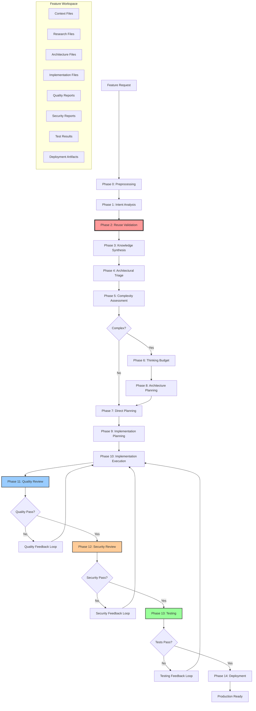

# Einstein Feature Orchestration Complete Architecture

## Overview

The **Einstein Feature System** is a comprehensive 14-phase orchestration platform that transforms natural language feature requests into fully implemented, tested, security-validated, and production-deployed code. Built on Claude Code's Task tool and 70+ specialized AI agents, it provides a systematic approach to feature development through intelligent workflow orchestration with compliance enforcement and iterative feedback loops.

## Architecture Philosophy

### Core Principles

1. **Reuse-First Development**: Mandatory exhaustive analysis of existing code before creation
2. **Systematic Orchestration**: Every feature goes through 14 structured phases for consistent quality
3. **Agent Specialization**: Each agent has specific expertise domain for optimal results
4. **Context Isolation**: Features get dedicated workspaces preventing interference
5. **Intelligent Research**: Automated research agents gather context before implementation
6. **Complexity-Adaptive Planning**: Different complexity levels trigger different orchestration strategies
7. **Iterative Quality Assurance**: Feedback loops enable automated remediation cycles
8. **Compliance Enforcement**: Validation gates ensure adherence to architectural standards

### Workflow Integration

The system integrates with:

- **Jira Integration**: Automatic ticket resolution and preprocessing
- **Claude Code Task Tool**: Primary agent spawning mechanism
- **Chariot Development Platform**: Aligned with repository patterns and tech stack
- **Quality Gates**: Enforced validation at each phase transition
- **Feedback Loops**: Iterative improvement cycles for quality, security, and testing

---

## System Architecture

### Complete 14-Phase Pipeline Structure



### Agent Ecosystem

The system employs **70+ specialized agents** organized into functional categories:

#### Core Orchestration Agents

- **preprocessing-orchestration**: Handles Jira reference detection and resolution with intelligent agent routing
- **intent-translator**: Transforms vague requests into structured requirements
- **knowledge-synthesizer**: Coordinates research and consolidates findings
- **complexity-assessor**: Evaluates implementation complexity and resource needs
- **architecture-coordinator**: Manages architectural analysis for complex features
- **implementation-planner**: Creates detailed execution plans with agent assignments
- **thinking-budget-allocator**: Optimizes AI resource allocation based on complexity

#### Quality & Security Coordinators

- **quality-coordinator**: Designs quality review strategies with feedback loops
- **security-coordinator**: Plans security analysis with threat assessment
- **test-coordinator**: Orchestrates testing strategies with remediation cycles
- **deployment-coordinator**: Manages deployment validation and rollback strategies
- **feedback-loop-coordinator**: Universal iteration management across all phases

#### Research & Analysis Agents

- **jira-reader**: Resolves Jira ticket references and provides context
- **context7-search-specialist**: Finds official library documentation and APIs
- **web-research-specialist**: Gathers industry best practices and current information
- **code-pattern-analyzer**: Analyzes existing codebase patterns and consistency
- **security-risk-assessor**: Contextual security risk evaluation
- **security-agent-strategist**: Optimal security team composition

#### Development Agents (65+ total)

Including specialized agents for:

- Frontend: `react-developer`, `react-typescript-architect`
- Backend: `golang-api-developer`, `golang-developer`, `python-developer`
- Testing: `unit-test-engineer`, `e2e-test-engineer`, `integration-test-engineer`
- Security: `go-security-reviewer`, `react-security-reviewer`
- Quality: `go-code-reviewer`, `react-code-reviewer`, `general-code-reviewer`
- Infrastructure: `aws-infrastructure-specialist`, `devops-automator`

---

## Reuse-First Compliance Framework

### Mandatory Exhaustive Reuse Analysis

**CRITICAL**: All development must prioritize extending existing code over creating new files.

#### Compliance Requirements

1. **Exhaustive Search Mandate**

   - Minimum 10 files must be analyzed before any creation justification
   - All relevant modules must be searched comprehensively
   - Pattern-based analysis required across codebase
   - Architecture documents must be reviewed for guidance

2. **Reusability Assessment Matrix**

   ```
   100% Reusable: Use as-is without modification
   80% Reusable: Extend existing implementation
   60% Reusable: Adapt existing patterns
   40% Reusable: Refactor for reuse
   0% Reusable: Creation justified (requires exhaustive documentation)
   ```

3. **Creation Justification Requirements**

   - Must analyze minimum 10 existing files
   - Document why each file cannot be reused
   - Provide technical proof of extension impossibility
   - Get architectural approval for new patterns

4. **Reuse Metrics Tracking**
   - Target: 70%+ overall reuse percentage
   - Track files analyzed vs files created
   - Monitor extension vs creation ratio
   - Report compliance violations

### Compliance Validation Gates

```bash
# Phase 2 Validation Gate
if [ "${REUSE_PERCENTAGE}" -lt 70 ]; then
    echo "⚠️ WARNING: Low reuse percentage: ${REUSE_PERCENTAGE}%"
    echo "Reuse-first validation expects >70% reuse"
fi

# Exhaustive Search Validation
if [ "${FILES_ANALYZED}" -lt 10 ]; then
    echo "❌ FAILURE: Insufficient exhaustive search"
    exit 1
fi
```

---

## Detailed Phase Documentation

### Phase 0: Preprocessing (Automatic)

**Responsible Agent**: `preprocessing-orchestration`

**Purpose**: Automatically detect and resolve Jira ticket references before main workflow execution.

**Key Features**:

- Pattern detection for Jira references (`CHA-1232`, `PROJ-123`)
- Intelligent routing based on resolved content
- Seamless handoff to appropriate next phase
- Token cost attribution to jira-reader agent

### Phase 1: Intent Analysis

**Responsible Agent**: `intent-translator`

**Purpose**: Transform ambiguous user requests into precise, actionable specifications.

**Output**: `.claude/features/{FEATURE_ID}/context/requirements.json`

### Phase 2: Existing Patterns & Code Synthesis (CRITICAL)

**Responsible Agent**: `code-pattern-analyzer`

**Purpose**: MANDATORY exhaustive analysis of existing code to enforce reuse-first development.

**Compliance Framework**:

- Exhaustive discovery methodology
- Multi-module keyword searches
- Pattern-based analysis
- Reusability assessment matrix
- Gap analysis documentation

**Outputs**:

- `.claude/features/{FEATURE_ID}/context/existing-implementation-discovery.md`
- `.claude/features/{FEATURE_ID}/context/implementation-gap-analysis.json`

**Validation**: Must pass reuse validation gate before proceeding

### Phase 3: Knowledge Synthesis

**Responsible Agent**: `knowledge-synthesizer`

**Purpose**: Analyze requirements and orchestrate targeted research to gather implementation context.

**Research Strategy**: Dynamic agent discovery and capability-based selection

**Outputs**:

- `.claude/features/{FEATURE_ID}/research/` - Individual research files
- `.claude/features/{FEATURE_ID}/context/knowledge-base.md` - Consolidated knowledge

### Phase 4: Architectural Impact Triage

**Responsible Agent**: `general-system-architect`

**Purpose**: Assess architectural implications building on Phase 2 reuse analysis.

**Key Features**:

- Extension assessment based on reuse findings
- Architectural pattern evaluation
- Phase 2 integration validation
- Impact analysis with reuse metrics

**Output**: `.claude/features/{FEATURE_ID}/context/impact-analysis.json`

### Phase 5: Complexity Assessment

**Responsible Agent**: `complexity-assessor`

**Purpose**: Quantify implementation complexity and determine resource allocation.

**Scoring Framework**:

- File Impact (0-30 points)
- Code Volume (0-30 points)
- Architectural Impact (0-20 points)
- Risk Factors (0-20 points)

**Complexity Levels**:

- Simple (0-30): Direct implementation
- Medium (31-70): Multi-phase approach
- Complex (71-100): Full architectural analysis

**Output**: `.claude/features/{FEATURE_ID}/context/complexity-assessment.json`

### Phase 6: Thinking Budget Optimization

**Responsible Agent**: `thinking-budget-allocator`

**Purpose**: Optimize AI agent thinking levels based on complexity and cost constraints.

**Resource Allocation Strategy**:

- Complexity-based thinking levels (ultrathink, think, basic)
- Cost estimation and transparency
- Alternative strategies for budget preferences
- Agent-specific optimization

**Output**: `.claude/features/{FEATURE_ID}/context/architecture-thinking-allocation.json`

### Phase 7: Architecture Planning (Complex Features Only)

**Responsible Agent**: `architecture-coordinator`

**Purpose**: Coordinate architectural analysis when complexity warrants specialized architects.

**Coordination Strategies**:

- `spawn_architects`: Multi-domain features
- `single_architect`: Single domain focus
- `skip_architecture`: Simple patterns

**Available Architects**:

- `react-typescript-architect`
- `go-backend-architect`
- `security-architect`
- `database-neo4j-architect`
- `cloud-aws-architect`

**Output**: `.claude/features/{FEATURE_ID}/architecture/coordination-plan.json`

### Phase 8: Implementation Planning

**Responsible Agent**: `implementation-planner`

**Purpose**: Transform all analysis phases into detailed, executable implementation plans.

**Key Requirements**:

- Dual output format (human-readable + machine-parseable)
- Agent assignments with reuse compliance
- Execution strategy determination
- Dependency mapping

**Outputs**:

- `.claude/features/{FEATURE_ID}/output/implementation-plan.md`
- `.claude/features/{FEATURE_ID}/output/agent-assignments.json`

### Phase 9: Implementation Execution

**Einstein Orchestration**: Direct agent coordination based on assignments

**Execution Patterns**:

- Parallel: Multiple agents simultaneously
- Phased: Primary agents, then secondary
- Sequential: Single agent or ordered execution

**Workspace Organization**:

```
implementation/
├── code-changes/{agent}/
├── agent-outputs/{agent}/
└── coordination/
```

### Phase 10: Quality Review

**Responsible Agent**: `quality-coordinator`

**Purpose**: Comprehensive quality validation with feedback loops.

**Quality Strategy**:

- Risk-appropriate quality depth
- Technology-specific quality agents
- Measurable quality gates
- Iterative improvement cycles

**Feedback Loop Pattern**:

```bash
MAX_ITERATIONS=3
while [ "${ITERATION_COMPLETE}" = false ]; do
    # Analyze results
    # Spawn remediation agents if needed
    # Re-validate after fixes
    # Complete or escalate
done
```

**Output**: `.claude/features/{FEATURE_ID}/quality-review/`

### Phase 11: Security Review

**Responsible Agent**: `security-coordinator`

**Purpose**: Security vulnerability assessment and remediation.

**Security Gates**:

- Critical blockers (authentication bypass, SQL injection, RCE)
- High priority (XSS, authorization flaws, data exposure)
- Medium priority (configuration, validation gaps)

**Feedback Loop**: Max 2 iterations for security remediation

**Output**: `.claude/features/{FEATURE_ID}/security-review/`

### Phase 12: Testing

**Responsible Agent**: `test-coordinator`

**Purpose**: Comprehensive test creation, execution, and remediation.

**Testing Strategy**:

- Test creation (unit, integration, E2E)
- Automated execution
- Failure remediation cycles
- Coverage validation

**Testing Gates**:

- Critical: All unit tests passing
- Major: Integration tests passing
- Minor: Coverage targets met

**Output**: `.claude/features/{FEATURE_ID}/testing/`

### Phase 13: Deployment

**Responsible Agent**: `deployment-coordinator`

**Purpose**: Production deployment with validation.

**Deployment Process**:

1. Build automation (`make chariot`)
2. Deployment execution
3. Health check validation
4. API availability verification
5. Post-deployment validation

**Deployment Gates**:

- Pre-deployment checks
- Post-deployment validation
- Rollback triggers

**Output**: `.claude/features/{FEATURE_ID}/deployment/`

---

## Feedback Loop Coordination Pattern

### Universal Feedback Loop Architecture

The `feedback-loop-coordinator` provides iterative improvement across all validation phases.

#### Core Capabilities

1. **Result Analysis**: Evaluate validation results from any phase
2. **Issue Prioritization**: Classify issues by severity and impact
3. **Agent Selection**: Choose optimal remediation agents
4. **Iteration Management**: Control retry cycles and escalation

#### Feedback Loop Execution Pattern

```json
{
  "iteration_management": {
    "current_iteration": 1,
    "max_iterations": 3,
    "issues_found": true,
    "issues_resolved": false,
    "escalation_required": false
  },
  "einstein_instructions": {
    "action": "spawn_remediation_agents|re_run_validation|complete|escalate",
    "execution_summary": "Clear instructions for Einstein",
    "spawning_details": [
      {
        "agent": "golang-api-developer",
        "instruction": "Fix SQL injection vulnerability in handler.go:145"
      }
    ]
  }
}
```

#### Phase-Specific Feedback Loops

- **Quality Review**: 3 iterations max, focuses on code quality
- **Security Review**: 2 iterations max, focuses on vulnerabilities
- **Testing**: 2 iterations max, focuses on test failures
- **Deployment**: 1 iteration max, focuses on platform stability

---

## Feature Workspace Management

### Complete Directory Structure

```
.claude/features/{FEATURE_ID}/
├── pipeline/                          # Pipeline execution logs
│   └── einstein-pipeline-*.log
├── context/                          # Requirements and analysis
│   ├── requirements.json              # Phase 1 output
│   ├── existing-implementation-discovery.md  # Phase 2 reuse analysis
│   ├── implementation-gap-analysis.json      # Phase 2 gap analysis
│   ├── knowledge-base.md              # Phase 3 synthesis
│   ├── impact-analysis.json           # Phase 4 triage
│   ├── complexity-assessment.json     # Phase 5 assessment
│   ├── architecture-thinking-allocation.json # Phase 6 optimization
│   ├── architect-context.md           # Phase 7 input
│   └── planning-context.md            # Phase 8 input
├── compliance/                        # Compliance tracking
│   └── compliance-tracker.json        # Reuse validation metrics
├── research/                          # Research outputs
│   ├── context7-documentation.md
│   ├── web-research-findings.md
│   └── code-patterns-analysis.md
├── architecture/                      # Architecture designs
│   ├── coordination-plan.json
│   ├── architecture-synthesis.md
│   └── [architect]-architecture.md
├── output/                           # Implementation plans
│   ├── implementation-plan.md
│   ├── agent-assignments.json
│   └── summary.md
├── implementation/                    # Code changes
│   ├── code-changes/
│   ├── agent-outputs/
│   └── coordination/
├── quality-review/                    # Quality validation
│   ├── feedback-loop/
│   └── quality-reports/
├── security-review/                   # Security analysis
│   ├── feedback-loop/
│   └── vulnerability-reports/
├── testing/                          # Test results
│   ├── feedback-loop/
│   └── test-reports/
├── deployment/                        # Deployment artifacts
│   ├── build-logs/
│   └── deployment-status.json
└── metadata.json                     # Feature tracking data
```

---

## Key Orchestration Patterns

### Concurrent Agent Execution

**Critical Rule**: All related operations must be batched in single messages for true parallelism.

```javascript
// ✅ CORRECT: Single message with multiple Task calls
[Single Message]:
  Task("context7-search-specialist", "Research Stripe API...", "context7-search-specialist")
  Task("web-research-specialist", "Research best practices...", "web-research-specialist")
  Task("code-pattern-analyzer", "Analyze patterns...", "code-pattern-analyzer")

// ❌ WRONG: Multiple messages break parallelism
```

### Thinking Budget Optimization

Dynamic resource allocation based on:

- Feature complexity score
- Risk level assessment
- Available budget constraints
- Agent-specific requirements

**Allocation Strategy**:

```
Complex (71-100): ultrathink for critical agents
Medium (31-70): think for standard agents
Simple (0-30): basic for simple tasks
```

### Compliance-First Development

Mandatory validation gates:

1. Reuse analysis before creation
2. Architectural compliance before implementation
3. Quality validation before security
4. Security clearance before testing
5. Test success before deployment

### Risk-Based Coordination

Different strategies based on risk assessment:

- **Critical Risk**: Comprehensive validation with all feedback loops
- **High Risk**: Focused validation with security emphasis
- **Medium Risk**: Standard validation with quality focus
- **Low Risk**: Basic validation with streamlined process

---

## Quality Gates & Validation

### Validation Checkpoints

#### Phase Transitions

- Requirements completeness (Phase 1 → 2)
- Reuse compliance (Phase 2 → 3)
- Research quality (Phase 3 → 4)
- Architectural approval (Phase 4 → 5)
- Complexity validation (Phase 5 → 6/7)
- Plan approval (Phase 8 → 9)
- Implementation quality (Phase 9 → 10)
- Quality clearance (Phase 10 → 11)
- Security clearance (Phase 11 → 12)
- Test success (Phase 12 → 13)
- Deployment readiness (Phase 13 → 14)

#### Gate Criteria

**Critical Gates** (Block progression):

- Reuse percentage < 70%
- Security vulnerabilities found
- Test failures in critical paths
- Platform deployment failures

**Major Gates** (Require remediation):

- Code quality issues
- Integration test failures
- Performance degradation
- Missing documentation

**Minor Gates** (Warnings only):

- Coverage below target
- Style violations
- Non-critical test failures

---

## Advanced Features

### Automatic Jira Integration

The `jira-reader` agent provides **preprocessing mode** that:

1. Detects references (patterns like `CHA-1232`, `PROJ-123`)
2. Resolves content via Atlassian MCP tools
3. Enriches input with structured ticket content
4. Seamless handoff to next phase

### Dynamic Agent Selection

Intelligent agent selection based on:

- Feature requirements and complexity
- Technology stack in use
- Existing codebase patterns
- Domain expertise needs
- Available agent capabilities

### Production Readiness Validation

Comprehensive deployment validation:

- Build success verification
- Platform health checks
- API availability testing
- Performance benchmarking
- Rollback capability confirmation

---

## Metrics & Analytics

### Pipeline Analytics

**Reuse Metrics**:

- Overall reuse percentage per feature
- Files analyzed vs created ratio
- Extension vs creation trends
- Compliance violation tracking

**Performance Metrics**:

- Phase completion times
- Agent execution duration
- Iteration counts per phase
- Success/failure rates

**Quality Metrics**:

- Issues found per phase
- Remediation effectiveness
- Escalation frequency
- Gate pass rates

### Reporting Dashboard

```
Feature: auth-system-20250114
├── Reuse: 85% (17 files extended, 3 created)
├── Iterations: Quality(2), Security(1), Testing(1)
├── Duration: 4.5 hours total
├── Agents Spawned: 12
└── Status: Successfully Deployed
```

---

## Usage Guide for Developers

### Initiating a Feature

```bash
# Natural language description
npx claude-code command einstein "Add dark mode toggle to user settings"

# With Jira reference
npx claude-code command einstein "Implement CHA-1232"

# Resume existing feature
npx claude-code command einstein "auth-system_20250114_142530"
```

### Monitoring Progress

```bash
# Check feature status
find .claude/features -name "metadata.json" \
  -exec jq -r '[.id, .status, .description] | @tsv' {} \;

# View pipeline logs
tail -f .claude/features/${FEATURE_ID}/pipeline/einstein-pipeline-*.log

# Check compliance metrics
cat .claude/features/${FEATURE_ID}/compliance/compliance-tracker.json
```

### Understanding Pipeline State

Each feature maintains state in `metadata.json`:

```json
{
  "id": "feature_20250114_142530",
  "status": "quality_review_completed",
  "description": "Add dark mode toggle",
  "phases_completed": ["design", "implementation"],
  "next_phase": "security-review",
  "reuse_percentage": 82,
  "iterations": {
    "quality": 2,
    "security": 0,
    "testing": 0
  }
}
```

---

## Best Practices

### For Feature Requests

1. **Be Specific**: Include context, constraints, success criteria
2. **Reference Existing**: Link to similar features or Jira tickets
3. **Specify Domains**: Indicate affected areas (frontend, backend, etc.)
4. **Define Done**: Clear acceptance criteria

### For Compliance

1. **Always Search First**: Exhaust existing code analysis
2. **Document Justification**: Thorough reasoning for any creation
3. **Track Metrics**: Monitor reuse percentages
4. **Review Violations**: Learn from compliance failures

### For Quality

1. **Trust the Process**: Let phases complete fully
2. **Review Feedback**: Understand iteration recommendations
3. **Monitor Gates**: Track gate pass/fail patterns
4. **Escalate Wisely**: Know when manual intervention needed

---

## Troubleshooting

### Common Issues

**Reuse Compliance Failures**:

- Ensure minimum 10 files analyzed
- Document specific technical limitations
- Provide extension impossibility proof

**Feedback Loop Exhaustion**:

- Check max iteration limits
- Review escalation criteria
- Analyze remediation effectiveness

**Agent Coordination Issues**:

- Verify parallel execution syntax
- Check agent dependencies
- Review execution group assignments

### Recovery Procedures

```bash
# Reset feature state
echo "STATUS=implementation_completed" > \
  .claude/features/${FEATURE_ID}/metadata.json

# Force phase transition
.claude/scripts/phases/complete-phase.sh \
  "current-phase" "next-phase" "${FEATURE_ID}"

# Clear feedback loop state
rm -rf .claude/features/${FEATURE_ID}/*/feedback-loop/
```

---

## Future Development

### Planned Enhancements

1. **Machine Learning Integration**: Pattern learning from successful implementations
2. **Predictive Analytics**: Complexity and risk prediction models
3. **Cross-Feature Intelligence**: Dependency detection and impact analysis
4. **Auto-Remediation**: Self-healing for common issues
5. **Cost Optimization**: Dynamic budget allocation based on ROI

### Extensibility Points

- **New Validation Phases**: Add domain-specific validation
- **Custom Compliance Rules**: Organization-specific standards
- **Integration Adapters**: Third-party tool integration
- **Feedback Strategies**: Custom remediation patterns
- **Gate Definitions**: Configurable quality thresholds

---

## Conclusion

The Einstein Feature Orchestration Architecture represents a mature, production-ready system for automated feature development with comprehensive quality assurance. Through its 14-phase pipeline, 70+ specialized agents, reuse-first compliance framework, and iterative feedback loops, it ensures consistent, high-quality feature delivery while minimizing technical debt and maximizing code reuse.

The system's strength lies in balancing automation with intelligent oversight - enforcing compliance while enabling flexibility, automating remediation while providing escalation paths, and optimizing resources while maintaining quality standards.

---

## Appendix: Complete Agent Reference

### Orchestration & Coordination (13)

- `preprocessing-orchestration` - Jira resolution and routing
- `intent-translator` - Requirements analysis
- `knowledge-synthesizer` - Research coordination
- `complexity-assessor` - Complexity evaluation
- `architecture-coordinator` - Architecture planning
- `implementation-planner` - Execution planning
- `thinking-budget-allocator` - Resource optimization
- `quality-coordinator` - Quality strategy
- `security-coordinator` - Security planning
- `test-coordinator` - Testing orchestration
- `deployment-coordinator` - Deployment validation
- `feedback-loop-coordinator` - Universal iteration management
- `hierarchical-coordinator` - Multi-agent workflow management

### Research & Analysis (10)

- `jira-reader` - Jira ticket resolution
- `context7-search-specialist` - Documentation search
- `web-research-specialist` - Web research
- `code-pattern-analyzer` - Pattern analysis
- `integration-pattern-discoverer` - Integration patterns
- `workflow-understanding-agent` - Workflow analysis
- `security-risk-assessor` - Risk evaluation
- `security-agent-strategist` - Security team planning
- `react-security-reviewer` - Frontend security
- `go-security-reviewer` - Backend security

### Architecture (7)

- `general-system-architect` - System design
- `security-architect` - Security architecture
- `information-architect` - Information structure
- `react-typescript-architect` - Frontend architecture
- `go-backend-architect` - Backend architecture
- `database-neo4j-architect` - Graph database design
- `cloud-aws-architect` - AWS infrastructure

### Development (20+)

- `react-developer` - React development
- `golang-api-developer` - Go API development
- `golang-developer` - Advanced Go development
- `python-developer` - Python development
- `integration-developer` - Third-party integrations
- `vql-developer` - VQL capabilities
- `makefile-developer` - Build automation
- `yaml-developer` - Infrastructure as code
- `ai-engineer` - AI/ML features
- And more specialized developers...

### Testing & Quality (15+)

- `unit-test-engineer` - Unit testing
- `e2e-test-engineer` - E2E automation
- `integration-test-engineer` - Integration testing
- `test-quality-assessor` - Test quality evaluation
- `test-coverage-auditor` - Coverage analysis
- `production-validator` - Production readiness
- `performance-analyzer` - Performance optimization
- `go-api-optimizer` - Go performance
- `go-code-reviewer` - Go code review
- `react-code-reviewer` - React code review
- `general-code-reviewer` - General review
- And more quality agents...

### Infrastructure & DevOps (5+)

- `aws-infrastructure-specialist` - AWS management
- `devops-automator` - CI/CD automation
- `chromatic-test-engineer` - Visual testing
- `playwright-explorer` - Frontend exploration
- And deployment specialists...

### Product & Documentation (6+)

- `jira-epic-writer` - Epic creation
- `jira-bug-filer` - Bug management
- `jira-story-writer` - Story creation
- `openapi-writer` - API documentation
- `uiux-designer` - UI/UX guidance
- And documentation specialists...

_Total: 70+ specialized agents providing comprehensive coverage across all aspects of feature development, from inception through production deployment._
